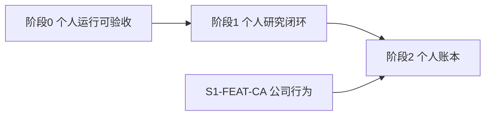

# QUAP 内部路线图

本文是**计划**，不是已实现架构。当前系统以 [系统架构设计](系统架构设计.md) 为准。基线是 QUAP **0.1.0**、分析版本 `0.1.0:native-2`、研究版本 `0.1.0:research-1`、Alembic `0003`。仓库内验证见 [系统验证报告](系统验证报告.md)：该报告证明夹具契约，不证明行情可用或生产已验收。

计划版本 **RM-3**。日期 2026-09-23。

## 1. 范围

本期只给**一个自然人**使用：一台由其本人控制的机器，一个 Tushare 账户，一个操作员令牌。数据只用于这个人的研究、篮子监控和自己的持仓记录。

本期到阶段 2 结束。阶段 0 先把现有承诺做成可验收，阶段 1 补上个人研究闭环，阶段 2 记自己的一本书。多租户、对外售卖行情、第二个登录身份和交易柜台都在本期范围之外，见 [第 9 节](#9-全局明确不做与停用-id)。

## 2. 怎么跟踪

状态只写在 [第 4 节总表](#4-总表)。阶段正文和资源说明不重复状态。

| 状态 | 含义 |
| --- | --- |
| 未开始 | 还没有实现工作，或资源还没有到位 |
| 进行中 | 已有实现分支、采购或运行记录 |
| 已验收 | 验收栏的证据已经写上，并且符合该条验收 |
| 取消 | 不再做。ID 保留，不把这个 ID 用于别的事项 |

规则：

- 条目 ID 稳定，不复用。新增条目用新 ID，并升计划版本。RM-1 停用的 ID 见第 9 节，不得重新启用为别的工作。
- 把一条标为「进行中」之前，它的依赖必须已是「已验收」。`S0-GATE` 没有功能依赖；它的依赖是阶段 0 的出口条目和主机资源。已经合并并由测试覆盖的代码可以标成「已验收」，证据写测试名；阶段门禁仍要等该阶段全部「必须」条目，包括还没到位的资源。
- 把 `S*-GATE` 标为「已验收」之前，该阶段所有「退出 = 必须」的条目必须已是「已验收」。
- 「授权触发」和「可选」不挡住阶段退出。没有相应供应商授权时保持「未开始」，不用其他数据源填上。
- 验收证据写测试名、演练记录、资格观察日期、授权说明或账户核对记录。只改状态字不算验收。
- 修改范围、验收或「明确不做」时，升 RM 版本，并在 [第 10 节](#10-修订记录) 写原因。

退出取值：

| 退出 | 含义 |
| --- | --- |
| 必须 | 本阶段退出前要验收 |
| 授权触发 | 有书面接口授权才开始；不阻挡本阶段退出 |
| 可选 | 本期可以做；不做也不阻挡阶段退出 |
| 门禁 | 汇总本阶段「必须」条目的阶段锁 |

## 3. 顺序

阶段 0 完成前，不开始阶段 1 和阶段 2。公司行为授权没有下来时，阶段 1 仍可退出，阶段 2 不开始。

## 4. 总表

证据列初始为「—」。状态初始全部为「未开始」。

| ID | 阶段 | 类型 | 名称 | 退出 | 依赖 | 状态 | 证据 |
| --- | --- | --- | --- | --- | --- | --- | --- |
| R0-HOST | 0 | 资源 | 仅本人使用的持续开主机与 Docker | 必须 | — | 未开始 | — |
| R0-NET | 0 | 资源 | 到 api.tushare.pro 的出网 | 必须 | R0-HOST | 未开始 | — |
| R0-REGISTRY | 0 | 资源 | 构建所需的镜像与包仓库 | 必须 | R0-HOST | 未开始 | — |
| R0-SECRETS | 0 | 资源 | 四份密钥只放在本人机器上 | 必须 | — | 未开始 | — |
| R0-TOKEN | 0 | 资源 | 个人 Tushare 令牌和五个必需接口 | 必须 | R0-SECRETS | 未开始 | — |
| R0-QUOTA | 0 | 资源 | 配额盖得住历史引导 | 必须 | R0-TOKEN | 未开始 | — |
| R0-BACKUP | 0 | 资源 | 另一故障域的加密备份 | 必须 | R0-HOST | 未开始 | — |
| R0-RESTORE | 0 | 资源 | 恢复演练用的空库 | 必须 | R0-BACKUP | 未开始 | — |
| R0-OBS | 0 | 资源 | 容器外的日志与指标目录 | 必须 | R0-HOST | 未开始 | — |
| R0-INDEX | 0 | 资源 | index_daily（沪深 300） | 授权触发 | R0-TOKEN | 未开始 | — |
| R0-SUSPEND | 0 | 资源 | suspend_d（停牌） | 授权触发 | R0-TOKEN | 未开始 | — |
| R0-LEGACY | 0 | 资源 | 旧监控运行时的只读目录 | 可选 | — | 未开始 | — |
| S0-SVC-OPS | 0 | 服务 | 备份与恢复演练记入 operations | 必须 | — | 进行中 | 副本校验与 RPO/RTO 计算见 `test_replica_is_a_different_directory_and_recovery_times_are_differences`。机外介质仍未验收 |
| S0-SVC-OBS | 0 | 服务 | 进程外指标与日志 | 必须 | R0-OBS | 已验收 | `test_data_quality_and_persisted_api_events` |
| S0-SVC-DBROLE | 0 | 服务 | 迁移、工人、只读查询分库角色 | 必须 | — | 已验收 | `test_read_role_cannot_write_and_worker_role_can` |
| S0-FEAT-BACKUP | 0 | 功能 | 备份离开同一故障域 | 必须 | S0-SVC-OPS, R0-BACKUP | 进行中 | 代码能把副本写到另一目录并核对校验和。`R0-BACKUP` 仍未开始 |
| S0-FEAT-RESTORE | 0 | 功能 | 恢复演练并记录实测 RPO/RTO | 必须 | S0-FEAT-BACKUP, R0-RESTORE | 进行中 | `restore-check --fault-at` 会写入 RPO/RTO。真实演练仍未开始 |
| S0-FEAT-DOCTOR | 0 | 功能 | 真实 Tushare doctor | 必须 | R0-TOKEN, R0-NET, R0-QUOTA | 未开始 | — |
| S0-FEAT-SOAK | 0 | 功能 | 两个交易日资格观察 | 必须 | S0-FEAT-DOCTOR | 未开始 | — |
| S0-FEAT-DQ | 0 | 功能 | 数据质量与容器健康分开展示 | 必须 | S0-SVC-OBS | 已验收 | `test_data_quality_and_persisted_api_events` |
| S0-GATE | 0 | 门禁 | 阶段 0 退出 | 门禁 | S0-FEAT-RESTORE, S0-FEAT-SOAK, S0-FEAT-DQ, S0-SVC-DBROLE, R0-HOST, R0-REGISTRY | 未开始 | — |
| R1-CHANNEL | 1 | 资源 | 发给自己的一种通知渠道 | 必须 | S0-GATE | 未开始 | — |
| R1-CA | 1 | 资源 | 公司行为接口授权 | 授权触发 | R0-TOKEN | 未开始 | — |
| R1-LIMIT | 1 | 资源 | 涨跌停与官方风险警示授权 | 授权触发 | R0-TOKEN | 未开始 | — |
| R1-FUND | 1 | 资源 | 估值与财务摘要授权 | 授权触发 | R0-TOKEN | 未开始 | — |
| R1-MEMBER | 1 | 资源 | 指数成分史授权 | 授权触发 | R0-TOKEN | 未开始 | — |
| R1-MINUTE | 1 | 资源 | 分钟线授权 | 授权触发 | R0-TOKEN | 未开始 | — |
| S1-SVC-RESEARCH | 1 | 服务 | research 工人 | 必须 | S0-GATE | 已验收 | `test_research_worker_withholds_orders_and_reuses_hash`。阶段 0 门禁未过，生产调度仍应等 `S0-GATE` |
| S1-SVC-NOTIFY | 1 | 服务 | notify 工人 | 必须 | S0-GATE | 已验收 | `test_alert_outbox_survives_failed_delivery` |
| S1-FEAT-PIT | 1 | 功能 | 用已有数据标记不可交易 | 必须 | S1-SVC-RESEARCH | 已验收 | `test_screen_uses_listing_and_suspension_flags` |
| S1-FEAT-FACTOR | 1 | 功能 | 因子注册与诊断 | 必须 | S1-SVC-RESEARCH | 已验收 | `test_research_hash_is_stable_and_withholds_unknown_limits` |
| S1-FEAT-BT | 1 | 功能 | 日频回测 | 必须 | S1-FEAT-PIT, S1-FEAT-FACTOR | 已验收 | `test_known_limits_trade_in_lots_without_calling_the_result_nav` |
| S1-FEAT-UI | 1 | 功能 | Research 工作区 | 必须 | S1-FEAT-BT | 已验收 | `test_dashboard_degraded_status_and_history_without_quotes` |
| S1-FEAT-OUTBOX | 1 | 功能 | 告警发给自己 | 必须 | S1-SVC-NOTIFY, R1-CHANNEL | 进行中 | `test_alert_outbox_survives_failed_delivery` 覆盖失败不删告警。真实渠道 `R1-CHANNEL` 仍未开始 |
| S1-FEAT-CA | 1 | 功能 | 公司行为事件表 | 授权触发 | S0-GATE, R1-CA | 未开始 | — |
| S1-FEAT-LIMIT | 1 | 功能 | 涨跌停与官方风险警示 | 授权触发 | S1-FEAT-PIT, R1-LIMIT | 未开始 | — |
| S1-FEAT-FUND | 1 | 功能 | 估值与财务摘要 | 授权触发 | S0-GATE, R1-FUND | 未开始 | — |
| S1-FEAT-MEMBER | 1 | 功能 | 指数成分史 | 授权触发 | S0-GATE, R1-MEMBER | 未开始 | — |
| S1-FEAT-MINUTE | 1 | 功能 | 已授权分钟线 | 授权触发 | S0-GATE, R1-MINUTE | 未开始 | — |
| S1-GATE | 1 | 门禁 | 阶段 1 退出 | 门禁 | S1-FEAT-UI, S1-FEAT-OUTBOX | 未开始 | — |
| S2-SVC-LEDGER | 2 | 服务 | ledger 工人 | 必须 | S1-GATE, S1-FEAT-CA | 未开始 | — |
| S2-FEAT-BOOK | 2 | 功能 | 现金、股数与公司行为过账 | 必须 | S2-SVC-LEDGER | 未开始 | — |
| S2-FEAT-NAV | 2 | 功能 | 损益与份额净值 | 必须 | S2-FEAT-BOOK | 未开始 | — |
| S2-FEAT-DRIFT | 2 | 功能 | 偏离与再平衡清单 | 必须 | S2-FEAT-BOOK | 未开始 | — |
| S2-FEAT-CONS | 2 | 功能 | 本人确认前的约束检查 | 必须 | S2-FEAT-DRIFT | 未开始 | — |
| S2-FEAT-ATTR | 2 | 功能 | 日频归因 | 必须 | S2-FEAT-NAV | 未开始 | — |
| S2-FEAT-CAL | 2 | 功能 | 公司行为日历 | 必须 | S1-FEAT-CA, S2-SVC-LEDGER | 未开始 | — |
| S2-FEAT-LABEL | 2 | 功能 | 净值与参考代理分开展示 | 必须 | S2-FEAT-NAV | 未开始 | — |
| S2-GATE | 2 | 门禁 | 阶段 2 退出 | 门禁 | S2-FEAT-CONS, S2-FEAT-ATTR, S2-FEAT-CAL, S2-FEAT-LABEL | 未开始 | — |

## 5. 阶段 0：个人运行可验收

目标：按 [部署说明](部署说明.md) 的口径，使「行情可用」和「生产已验收」各有独立证据。使用者仍是现有的单操作员。不增加新的研究指标。

不新增 Compose 服务。扩展现有 `operations`、`api`、工人和看板。

### 资源

资源的取得标准见 [第 8 节](#8-资源需求)。阶段 0 的必须资源是 `R0-HOST`、`R0-NET`、`R0-REGISTRY`、`R0-SECRETS`、`R0-TOKEN`、`R0-QUOTA`、`R0-BACKUP`、`R0-RESTORE`、`R0-OBS`。

### 服务

| ID | 落点 | 变更 |
| --- | --- | --- |
| S0-SVC-OPS | `operations` | 备份作业记录副本位置、校验和、完成时刻。恢复演练写入独立记录，不把容器健康当作恢复成功 |
| S0-SVC-OBS | `api` 与全部工人 | 指标和日志写到 `R0-OBS`，进程重启后仍可查询。进程内五分钟窗口可以保留，但不能再是唯一出口 |
| S0-SVC-DBROLE | `postgres`、`migrate`、`api`、工人 | 迁移、写入工人、看板所用的只读查询使用不同数据库角色。这是同一台机器上的权限分离，不是多租户。供应商密钥仍然只挂给需要 Tushare 的工人 |

### 功能

| ID | 功能 | 验收 |
| --- | --- | --- |
| S0-FEAT-BACKUP | 生产备份写到与 Docker 宿主机故障域不同的目录，并完成至少一次机外复制 | 源库所在磁盘不可用的假设下，副本文件仍可读取；校验和与作业记录一致 |
| S0-FEAT-RESTORE | 用机外副本做一次恢复演练 | 演练库中的 `reports` 可查询。记录备份完成时刻、假设故障时刻、恢复完成时刻，并由此写出本次 RPO 与 RTO。不预填尚未测量的目标数字 |
| S0-FEAT-DOCTOR | 用个人生产令牌对 `stock_basic`、`trade_cal`、`daily`、`adj_factor`、`rt_k` 做真实访问 | 空响应不算通过。权限失败保持阻塞。探测过程不改用公开源 |
| S0-FEAT-SOAK | 按现有资格规则观察两个已完成交易日 | 每个交易日至少 236 个样本、至少 99% 健康样本、合格市场覆盖至少 95%，且 scheduler、quotes、history、analysis、operations 心跳健康。错过的分钟不能补造 |
| S0-FEAT-DQ | 看板 Operations 增加数据质量区 | 同一页能看到缺失 K 线、因子修订、过期行情、能力阻塞。这些状态与容器健康分开。断线时仍提示保留数据不是实盘 |

### 阶段验收

`S0-GATE`：上表全部「必须」条目已验收，且必须资源已验收。同时复核三条现行边界：公开行情和合成数据不能进入生产链路；浏览器不持有 Tushare 令牌；界面和 API 仍绑在回环地址。人如果不在这台机器前，用 SSH 隧道访问，不把绑定地址改到公网。

### 本阶段明确不做

- 不新增技术指标、筛选规则或回测。
- 不引入 Redis、Kafka、外部调度器或模型训练服务。
- 不增加第二个登录身份。
- 不把财务、分钟线或 Level-2 放进采集范围。
- 不修改分析版本 `0.1.0:native-2` 的指标定义。

## 6. 阶段 1：个人研究闭环

目标：同一个人可以在钉住的数据水位上重复筛选、查看候选，并用日频回测检查规则。批准篮子仍是这个人的明确操作，沿用现有批准接口，不新增账号。

### 服务

| ID | 落点 | 变更 |
| --- | --- | --- |
| S1-SVC-RESEARCH | 新增 `research` 工人与队列 | 承接因子计算和日频回测。与 `analysis` 分开，避免全市场计算堵住盘中观察。领取后写入数据集水位、宇宙、规则、分析版本；重试复用该快照 |
| S1-SVC-NOTIFY | 新增 `notify` 工人 | 只把已持久化的告警送给 `R1-CHANNEL`。外送失败不删除告警，也不重新武装边沿 |

`scheduler` 增加对 `research` 队列的入队。`analysis` 继续负责盘中观察和现有日频报告。Qlib 导出仍是可选 profile，失败不停止 `research`。不新增身份服务。

### 功能

| ID | 功能 | 验收 |
| --- | --- | --- |
| S1-FEAT-PIT | 筛选和回测使用已有主数据、日历和已采集的停牌事件，把未上市、已退市、停牌和日历缺口标成不可交易 | 这些日期不补零、不连成假序列。名称正则 `ST\|退` 只作辅助，不再是唯一风险标记。没有 `suspend_d` 时，停牌保持未知，不猜测 |
| S1-FEAT-FACTOR | 因子注册表延续可版本化分析。第一批只包括动量、波动、流动性、回撤、相对沪深 300 | 每个因子给出 IC、Rank IC、分组收益和换手。没有 `index_daily` 时，相对沪深 300 标成不可用，不改用替代指数 |
| S1-FEAT-BT | 日频回测读取已复权研究价和未复权成交量 | 规则固定为 T+1、印花税与佣金、涨跌停不可成交、停牌跳过、整手、固定滑点。同一规则、同一水位重跑，候选列表与回测摘要哈希一致。输出字段不叫净值。涨跌停授权未到位时，该日成交性为未知 |
| S1-FEAT-UI | 看板增加 Research 工作区 | 同一个人能查看规则运行、候选解释和回测摘要。Stocks、Baskets、Candidates、Reports、Operations 仍可用。登录仍是原来的一个操作员令牌 |
| S1-FEAT-OUTBOX | 告警送到本人的一个渠道 | 外送载荷带同一 `event_key`。渠道失败时告警仍留在库内，覆盖不足的观察仍然不能触发告警 |
| S1-FEAT-CA | 分红、送转等公司行为单独成表。复权因子继续只表示价格尺度 | 仅在 `R1-CA` 已验收后采集。同一事件可按公告日与生效日查询 |
| S1-FEAT-LIMIT | 涨跌停与官方风险警示进入 PIT 标记 | 仅在 `R1-LIMIT` 已验收后采集 |
| S1-FEAT-FUND | 估值与财务摘要 | 仅在 `R1-FUND` 已验收后采集。无授权的字段保持空白，筛选不把空白当成零 |
| S1-FEAT-MEMBER | 指数成分历史，成分带日期 | 仅在 `R1-MEMBER` 已验收后采集。没有成分史时，不把当日等权板块覆盖称作指数 |
| S1-FEAT-MINUTE | 分钟线用于观察和回测对齐 | 仅在 `R1-MINUTE` 已验收后采集。存储与 `rt_k` 快照区分。不把分钟线展示成逐笔 |

### 阶段验收

`S1-GATE`：本阶段「必须」条目已验收。日历缺口仍使受影响交易日的指标处于 `calendar_gaps`。研究运行不导入 Qlib。登录身份仍然只有一个。

`S1-FEAT-CA` 不在此门禁内。阶段 2 开始前它必须单独验收。

### 本阶段明确不做

- 不增加研究员、审批人或其他登录身份。
- 不连接交易网关，不导出可直接报单的委托文件。
- 不把分钟线、快照或日 K 称为逐笔或 Level-2。
- 不提供模型训练、参数自动搜索或策略商城。
- 不把日频参考代理改名为净值。
- 不使用公开网站补未授权字段。

## 7. 阶段 2：个人账本

目标：这个人自己的目标权重和实际持仓能对上。账本结果可手工复核。清单留在本机，不送往柜台，也不交给别人。

前提：`S1-GATE` 已验收，且 `S1-FEAT-CA` 已验收。没有公司行为事件表时不开始本阶段。

### 服务

| ID | 落点 | 变更 |
| --- | --- | --- |
| S2-SVC-LEDGER | 新增 `ledger` 工人 | 过账现金、股数和公司行为。与 `analysis` 的参考代理分表存储。看板和 API 只读账本，不在请求路径里算净值。只有这一本书 |

### 功能

| ID | 功能 | 验收 |
| --- | --- | --- |
| S2-FEAT-BOOK | 记录现金、股数和公司行为过账 | 用一笔已知分红和一笔已知停牌做手工复核，股数与现金和事件记录一致 |
| S2-FEAT-NAV | 已实现损益、未实现损益和份额净值 | 净值有独立字段名和独立序列。计算输入可以追溯到过账和复权前价格 |
| S2-FEAT-DRIFT | 比较目标权重与实际持仓，导出再平衡清单 | 清单含代码、方向、数量和来源篮子修订。导出文件留在本机，不产生委托 |
| S2-FEAT-CONS | 本人保存下一交易日篮子前检查单票权重、板块上限、流动性和换手 | 超限时拒绝并写明哪一条约束。阈值来自已版本化的规则，不写死在看板里 |
| S2-FEAT-ATTR | 相对已授权的沪深 300 做日频配置与选股归因 | 没有 `index_daily` 时结果为不可用。不用等权板块收益顶替官方基准 |
| S2-FEAT-CAL | 展示尚未生效的公司行为 | 日历条目来自 `S1-FEAT-CA`，能对应到账本将要过账的事件 |
| S2-FEAT-LABEL | 看板把净值与参考代理分开 | 同一图表、同一表格、同一导出文件里不混放这两个序列 |

### 阶段验收

`S2-GATE`：本阶段「必须」条目已验收。现有篮子告警仍使用覆盖率和参考代理规则，不改读净值。账本只有一本，登录仍然只有一个。

### 本阶段明确不做

- 不发送柜台，不自动下单，不自动再平衡。
- 不做第二本书，不记录别人的持仓。
- 不引入多因子风险模型、跟踪误差优化器或组合优化器。
- 不把账本收益写成业绩承诺。

## 8. 资源需求

密钥和令牌只放在本人机器的受保护目录。不要把它们发到对话、邮件、截图或仓库。只有本人登录的机器可以沿用 `deploy/secrets/` 的目录模式；准备脚本不证明供应商权限。

当前代码只登记七个接口：`stock_basic`、`trade_cal`、`daily`、`adj_factor`、`rt_k`、`index_daily`、`suspend_d`。新的数据类在授权说明里写清接口名之后才采集。

### 阶段 0 必须备齐

| ID | 资源 | 验收 |
| --- | --- | --- |
| R0-HOST | 一台仅本人使用、持续开机的 Linux 主机，安装 Docker Engine 与 Compose v2。时钟与 Asia/Shanghai 对齐 | 主机关机或睡眠会停采集；浏览器关闭不会。人不在机器前时用 SSH 隧道，端口保持回环 |
| R0-NET | 到 `https://api.tushare.pro` 的出网。校验证书，不走环境代理 | `doctor` 的判定来自真实访问，而不是只看 HTTP 200 |
| R0-REGISTRY | 构建镜像时能访问的镜像仓库和包仓库 | 原生镜像能构建并拉起 |
| R0-SECRETS | 四份文件：`postgres_password`、`database_url`、`api_token`、`tushare_token`。操作员令牌至少 32 字符。数据库 URL 与 PostgreSQL 密码一致 | 四份文件不在 Git、镜像和浏览器里。看板只接受操作员令牌 |
| R0-TOKEN | 个人 Tushare Pro 令牌，具备 `stock_basic`、`trade_cal`、`daily`、`adj_factor` 和单独的 `rt_k`。生产环境 `QUANT_ENVIRONMENT=production` | 付费本身不算权限。`doctor` 的 `missing` 为空；空响应不算通过 |
| R0-QUOTA | 账户实际额度不低于平台配置。默认是实时 40 次/分钟、其他接口 20 次/分钟、每接口 8000 次/天 | 配置不高于账户额度。约 500 个交易日的日 K 和复权因子能引导完；超限等待，权限失败保持阻塞 |
| R0-BACKUP | 与 Docker 宿主机不在同一故障域的备份位置，副本加密。本机目录由 UID 10001 可写 | 源库磁盘不可用时，副本仍能读取 |
| R0-RESTORE | 一份用于演练的空库和私有 DSN，库名按 `quant_restore_*` | 能从机外副本恢复，且与生产库名不同 |
| R0-OBS | 容器可写层之外的日志与指标目录。不购买监控服务 | 进程重启后仍能读到阶段 0 写出的记录 |

### 阶段 0 有授权或有旧系统才备

| ID | 资源 | 验收 |
| --- | --- | --- |
| R0-INDEX | `index_daily`，用于沪深 300 | 授权说明里有该接口。没有则超额收益和阶段 2 归因保持不可用 |
| R0-SUSPEND | `suspend_d`，用于停牌 | 授权说明里有该接口。没有则停牌保持未知 |
| R0-LEGACY | 旧监控运行时目录的只读访问，以及本人写下的一次所有权切换 | 仅在要从旧监控迁移时才需要。切换完成前，两套进程不采集同一观察列表 |

### 阶段 1 必须另备

| ID | 资源 | 验收 |
| --- | --- | --- |
| R1-CHANNEL | 一个发给自己的渠道：企业微信机器人、本人已有邮箱的 SMTP，或本人控制的 Webhook。三选一 | 能收到一条带 `event_key` 的测试告警。不新增付费账号类型 |

### 阶段 1 有授权才备

这些资源不挡住阶段 1 退出。`R1-CA` 不到位时，阶段 2 不开始。

| ID | 资源 | 对应功能 | 没有它时 |
| --- | --- | --- | --- |
| R1-CA | 分红、送转，能区分公告日和生效日 | `S1-FEAT-CA` | 阶段 1 可退出；阶段 2 不开始 |
| R1-LIMIT | 涨跌停价、官方风险警示 | `S1-FEAT-LIMIT` | 回测把涨跌停标成未知 |
| R1-FUND | 估值与财务摘要 | `S1-FEAT-FUND` | 字段保持空白 |
| R1-MEMBER | 带日期的指数成分 | `S1-FEAT-MEMBER` | 不把等权板块称作指数 |
| R1-MINUTE | 分钟线，与 `rt_k` 快照分开 | `S1-FEAT-MINUTE` | 继续使用快照和日 K |

### 阶段 2

不需要新的供应商账户。沿用个人 Tushare 令牌；公司行为以 `R1-CA` 为准。归因使用已经授权的 `index_daily`，没有则标成不可用。

### 本期不准备

- 第二个操作员账号、身份云、租户令牌。
- 行情再分发合同、对外域名、TLS 证书、状态页、收款和发票主体。
- 券商交易账户、柜台 API、程序化交易报备材料。
- Redis、Kafka、第二行情源、Wind 或聚源、Level-2、北交所权限、模型训练云。
- 监控 SaaS。日志留在 `R0-OBS`。
- Qlib 镜像、AMD64 模拟和外部研究数据集。原生路径不依赖它们；要做可选导出时再单独准备。

## 9. 全局明确不做与停用 ID

下列决定在 RM-2 有效。要取消某一条，必须升计划版本并写明替代边界。

| ID | 决定 |
| --- | --- |
| NG-01 | 原生采集、分析、看板和本期队列不引入 Redis、Kafka 或外部调度器 |
| NG-02 | 公开行情和合成数据不是生产回退 |
| NG-03 | Qlib 不是采集、分析、看板或 `research` 的运行时依赖 |
| NG-04 | 报单代码不进入研究进程 |
| NG-05 | 不承诺收益。日频参考代理不称作净值。净值只来自阶段 2 账本 |
| NG-06 | 不建策略商城，不用回测曲线做获客页面 |
| NG-07 | 北交所不进入股票池 |
| NG-08 | 本期不采集 Level-2 或逐笔成交 |
| NG-09 | 不把尚未测量的 RPO/RTO 写成数字目标。阶段 0 只记录实测值 |
| NG-10 | 不做多租户、entitlement、billing、对外 Research API 和对外状态页 |
| NG-11 | 不提供第二个登录身份。批准篮子仍是同一个操作员的明确操作 |
| NG-12 | 不再分发或转售行情，不签对外数据服务合同 |
| NG-13 | 本期不接入交易柜台，不准备券商交易账号 |

RM-1 的下列 ID 自 RM-2 起停用，不得改指别的工作：

`S1-SVC-IDENTITY`、`S1-FEAT-RBAC`、`S1-FEAT-APPROVAL`、`S3-SVC-ENTITLE`、`S3-SVC-BILL`、`S3-SVC-TENANT`、`S3-FEAT-ISO`、`S3-FEAT-QUOTA`、`S3-FEAT-API`、`S3-FEAT-STATUS`、`S3-FEAT-EXPORT`、`S3-GATE`、`S4-SVC-GW`、`S4-FEAT-HANDOFF`、`S4-FEAT-PRE`、`S4-FEAT-ADAPTER`、`S4-FEAT-KILL`、`S4-FEAT-RECON`、`S4-GATE`。

## 10. 修订记录

| 版本 | 日期 | 变更 |
| --- | --- | --- |
| RM-1 | 2026-09-23 | 初版。阶段 0 到阶段 4，含多租户研究 SaaS 和独立交易网关 |
| RM-2 | 2026-09-23 | 收窄为个人使用。本期止于阶段 2。停用多租户、第二个登录身份和交易网关条目。资源需求并入总表 |
| RM-3 | 2026-09-23 | 实现阶段 0 的角色、进程外日志、数据质量和备份副本记录，以及阶段 1 的研究回测与告警外送。阶段 2 和授权触发项仍未开始 |
