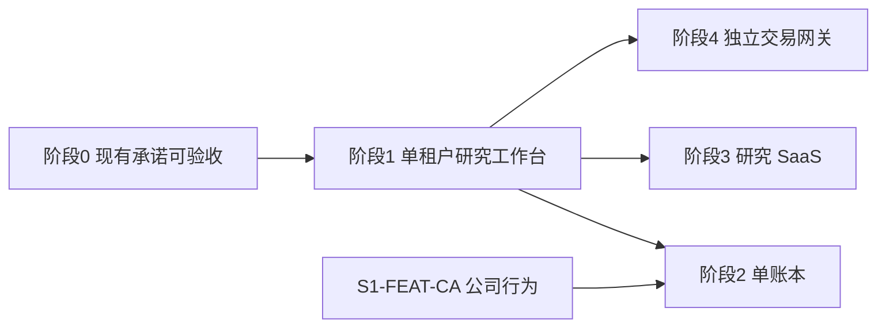

# QUAP 内部路线图

本文是**计划**，不是已实现架构。当前系统以 [系统架构设计](系统架构设计.md) 为准。基线是 QUAP **0.1.0**、分析版本 `0.1.0:native-2`、Alembic `0002`。仓库内验证见 [系统验证报告](系统验证报告.md)：该报告证明夹具契约，不证明行情可用或生产已验收。

计划版本 **RM-1**。日期 2026-09-23。

## 1. 怎么跟踪

状态只写在 [第 3 节总表](#3-总表)。阶段正文不重复状态，避免两处改到不一致。

| 状态 | 含义 |
| --- | --- |
| 未开始 | 还没有实现工作 |
| 进行中 | 已有实现分支或运行记录 |
| 已验收 | 验收栏的证据已经写上，并且符合该条验收 |
| 取消 | 不再做。ID 保留，不把这个 ID 用于别的事项 |

规则：

- 条目 ID 稳定，不复用。新增条目用该阶段下一个未用 ID，并升计划版本。
- 把一条标为「进行中」之前，它的依赖必须已是「已验收」。`S0-GATE` 没有功能依赖。
- 把 `S*-GATE` 标为「已验收」之前，该阶段所有「退出 = 必须」的条目必须已是「已验收」。
- 「授权触发」不挡住阶段退出。没有相应供应商授权时保持「未开始」，不用其他数据源填上。
- 验收证据写测试名、演练记录、资格观察日期或审查结论。只改状态字不算验收。
- 修改范围、验收或「明确不做」时，升 RM 版本，并在 [第 10 节](#10-修订记录) 写原因。

退出取值：

| 退出 | 含义 |
| --- | --- |
| 必须 | 本阶段退出前要验收 |
| 授权触发 | 有书面接口授权才开始；不阻挡本阶段退出 |
| 门禁 | 汇总本阶段「必须」条目的阶段锁 |

## 2. 顺序

商业化差距在研究闭环、组合会计和可签约交付。任务可靠性已经有围栏、水位和资格观察，不靠换队列或提前做交易来补。

阶段 3 还要有行情再分发的书面授权。阶段 4 还要有程序化报单的书面法务结论。这两份文件都不是工程验收可以代替的。阶段 2、3、4 在各自前提满足后可以并行，研究进程里仍然不放报单代码。

阶段 0 完成前，不开始阶段 1 及以后的条目。

## 3. 总表

证据列初始为「—」。状态初始全部为「未开始」。

| ID | 阶段 | 类型 | 名称 | 退出 | 依赖 | 状态 | 证据 |
| --- | --- | --- | --- | --- | --- | --- | --- |
| S0-SVC-OPS | 0 | 服务 | 备份与恢复演练记入 operations | 必须 | — | 未开始 | — |
| S0-SVC-OBS | 0 | 服务 | 进程外指标与日志 | 必须 | — | 未开始 | — |
| S0-SVC-DBROLE | 0 | 服务 | 迁移、工人、只读查询分库角色 | 必须 | — | 未开始 | — |
| S0-FEAT-BACKUP | 0 | 功能 | 备份离开同一故障域 | 必须 | S0-SVC-OPS | 未开始 | — |
| S0-FEAT-RESTORE | 0 | 功能 | 恢复演练并记录实测 RPO/RTO | 必须 | S0-FEAT-BACKUP | 未开始 | — |
| S0-FEAT-DOCTOR | 0 | 功能 | 真实 Tushare doctor | 必须 | — | 未开始 | — |
| S0-FEAT-SOAK | 0 | 功能 | 两个交易日资格观察 | 必须 | S0-FEAT-DOCTOR | 未开始 | — |
| S0-FEAT-DQ | 0 | 功能 | 数据质量与容器健康分开展示 | 必须 | S0-SVC-OBS | 未开始 | — |
| S0-GATE | 0 | 门禁 | 阶段 0 退出 | 门禁 | S0-FEAT-RESTORE, S0-FEAT-SOAK, S0-FEAT-DQ, S0-SVC-DBROLE | 未开始 | — |
| S1-SVC-RESEARCH | 1 | 服务 | research 工人 | 必须 | S0-GATE | 未开始 | — |
| S1-SVC-NOTIFY | 1 | 服务 | notify 工人 | 必须 | S0-GATE | 未开始 | — |
| S1-SVC-IDENTITY | 1 | 服务 | api 内身份模块 | 必须 | S0-GATE | 未开始 | — |
| S1-FEAT-PIT | 1 | 功能 | 用已有数据标记不可交易 | 必须 | S1-SVC-RESEARCH | 未开始 | — |
| S1-FEAT-FACTOR | 1 | 功能 | 因子注册与诊断 | 必须 | S1-SVC-RESEARCH | 未开始 | — |
| S1-FEAT-BT | 1 | 功能 | 日频回测 | 必须 | S1-FEAT-PIT, S1-FEAT-FACTOR | 未开始 | — |
| S1-FEAT-RBAC | 1 | 功能 | 研究员与审批人 | 必须 | S1-SVC-IDENTITY | 未开始 | — |
| S1-FEAT-APPROVAL | 1 | 功能 | 审批评论与成员差异 | 必须 | S1-FEAT-RBAC | 未开始 | — |
| S1-FEAT-UI | 1 | 功能 | Research 工作区 | 必须 | S1-FEAT-BT, S1-FEAT-APPROVAL | 未开始 | — |
| S1-FEAT-OUTBOX | 1 | 功能 | 告警外送 | 必须 | S1-SVC-NOTIFY | 未开始 | — |
| S1-FEAT-CA | 1 | 功能 | 公司行为事件表 | 授权触发 | S0-GATE | 未开始 | — |
| S1-FEAT-LIMIT | 1 | 功能 | 涨跌停与官方风险警示 | 授权触发 | S1-FEAT-PIT | 未开始 | — |
| S1-FEAT-FUND | 1 | 功能 | 估值与财务摘要 | 授权触发 | S0-GATE | 未开始 | — |
| S1-FEAT-MEMBER | 1 | 功能 | 指数成分史 | 授权触发 | S0-GATE | 未开始 | — |
| S1-FEAT-MINUTE | 1 | 功能 | 已授权分钟线 | 授权触发 | S0-GATE | 未开始 | — |
| S1-GATE | 1 | 门禁 | 阶段 1 退出 | 门禁 | S1-FEAT-UI, S1-FEAT-OUTBOX | 未开始 | — |
| S2-SVC-LEDGER | 2 | 服务 | ledger 工人 | 必须 | S1-GATE, S1-FEAT-CA | 未开始 | — |
| S2-FEAT-BOOK | 2 | 功能 | 现金、股数与公司行为过账 | 必须 | S2-SVC-LEDGER | 未开始 | — |
| S2-FEAT-NAV | 2 | 功能 | 损益与份额净值 | 必须 | S2-FEAT-BOOK | 未开始 | — |
| S2-FEAT-DRIFT | 2 | 功能 | 偏离与再平衡清单 | 必须 | S2-FEAT-BOOK | 未开始 | — |
| S2-FEAT-CONS | 2 | 功能 | 审批前约束 | 必须 | S2-FEAT-DRIFT | 未开始 | — |
| S2-FEAT-ATTR | 2 | 功能 | 日频归因 | 必须 | S2-FEAT-NAV | 未开始 | — |
| S2-FEAT-CAL | 2 | 功能 | 公司行为日历 | 必须 | S1-FEAT-CA, S2-SVC-LEDGER | 未开始 | — |
| S2-FEAT-LABEL | 2 | 功能 | 净值与参考代理分开展示 | 必须 | S2-FEAT-NAV | 未开始 | — |
| S2-GATE | 2 | 门禁 | 阶段 2 退出 | 门禁 | S2-FEAT-CONS, S2-FEAT-ATTR, S2-FEAT-CAL, S2-FEAT-LABEL | 未开始 | — |
| S3-SVC-ENTITLE | 3 | 服务 | entitlement | 必须 | S1-GATE | 未开始 | — |
| S3-SVC-BILL | 3 | 服务 | billing | 必须 | S3-SVC-ENTITLE | 未开始 | — |
| S3-SVC-TENANT | 3 | 服务 | 租户隔离 | 必须 | S1-GATE | 未开始 | — |
| S3-FEAT-ISO | 3 | 功能 | 租户数据、产物与令牌隔离 | 必须 | S3-SVC-TENANT | 未开始 | — |
| S3-FEAT-QUOTA | 3 | 功能 | 配额、用量与账单 | 必须 | S3-SVC-BILL, S3-FEAT-ISO | 未开始 | — |
| S3-FEAT-API | 3 | 功能 | 只读 Research API | 必须 | S3-FEAT-ISO | 未开始 | — |
| S3-FEAT-STATUS | 3 | 功能 | 状态页 | 必须 | S0-SVC-OBS, S3-SVC-TENANT | 未开始 | — |
| S3-FEAT-EXPORT | 3 | 功能 | 按授权控制导出 | 必须 | S3-SVC-ENTITLE, S3-FEAT-ISO | 未开始 | — |
| S3-GATE | 3 | 门禁 | 阶段 3 退出 | 门禁 | S3-FEAT-QUOTA, S3-FEAT-API, S3-FEAT-STATUS, S3-FEAT-EXPORT | 未开始 | — |
| S4-SVC-GW | 4 | 服务 | 独立 gateway | 必须 | S1-FEAT-APPROVAL | 未开始 | — |
| S4-FEAT-HANDOFF | 4 | 功能 | 只接收已审批目标清单 | 必须 | S4-SVC-GW | 未开始 | — |
| S4-FEAT-PRE | 4 | 功能 | 事前风控 | 必须 | S4-FEAT-HANDOFF | 未开始 | — |
| S4-FEAT-ADAPTER | 4 | 功能 | 柜台适配 | 必须 | S4-FEAT-PRE | 未开始 | — |
| S4-FEAT-KILL | 4 | 功能 | 杀停 | 必须 | S4-FEAT-ADAPTER | 未开始 | — |
| S4-FEAT-RECON | 4 | 功能 | 委托与成交对账 | 必须 | S4-FEAT-ADAPTER | 未开始 | — |
| S4-GATE | 4 | 门禁 | 阶段 4 退出 | 门禁 | S4-FEAT-KILL, S4-FEAT-RECON | 未开始 | — |

阶段 3 在总表依赖之外，还有一份非代码前提：行情再分发书面授权。没有该文件时，阶段 3 全部保持「未开始」。阶段 4 的非代码前提是程序化报单的书面法务结论；没有该结论时，阶段 4 全部保持「未开始」。

## 4. 阶段 0：现有承诺可验收

目标：按 [部署说明](部署说明.md) 的口径，使「行情可用」和「生产已验收」各有独立证据。不增加新的研究指标。

不新增 Compose 服务。扩展现有 `operations`、`api`、工人和看板。

### 服务

| ID | 落点 | 变更 |
| --- | --- | --- |
| S0-SVC-OPS | `operations` | 备份作业记录副本位置、校验和、完成时刻。恢复演练写入独立记录，不把容器健康当作恢复成功 |
| S0-SVC-OBS | `api` 与全部工人 | 指标和日志可以在进程重启后继续查询。进程内五分钟窗口可以保留，但不能再是唯一出口 |
| S0-SVC-DBROLE | `postgres`、`migrate`、`api`、工人 | 迁移、写入工人、看板所用的只读查询使用不同数据库角色。供应商密钥仍然只挂给需要 Tushare 的工人 |

### 功能

| ID | 功能 | 验收 |
| --- | --- | --- |
| S0-FEAT-BACKUP | 生产备份写到与 Docker 宿主机故障域不同的目录，并完成至少一次机外复制 | 源库所在磁盘不可用的假设下，副本文件仍可读取；校验和与作业记录一致 |
| S0-FEAT-RESTORE | 用机外副本做一次恢复演练 | 演练库中的 `reports` 可查询。记录备份完成时刻、假设故障时刻、恢复完成时刻，并由此写出本次 RPO 与 RTO。不在本计划里预填尚未测量的目标数字 |
| S0-FEAT-DOCTOR | 用生产令牌对 `stock_basic`、`trade_cal`、`daily`、`adj_factor`、`rt_k` 做真实访问 | 空响应不算通过。权限失败保持阻塞。探测过程不改用公开源 |
| S0-FEAT-SOAK | 按现有资格规则观察两个已完成交易日 | 每个交易日至少 236 个样本、至少 99% 健康样本、合格市场覆盖至少 95%，且 scheduler、quotes、history、analysis、operations 心跳健康。错过的分钟不能补造 |
| S0-FEAT-DQ | 看板 Operations 增加数据质量区 | 同一页能看到缺失 K 线、因子修订、过期行情、能力阻塞。这些状态与容器健康分开。断线时仍提示保留数据不是实盘 |

### 阶段验收

`S0-GATE`：上表全部「必须」条目已验收。同时复核三条现行边界仍然成立：公开行情和合成数据不能进入生产链路；浏览器不持有 Tushare 令牌；界面和 API 仍绑在回环地址，对公网开放必须另有 TLS 与认证，而不是只改绑定地址。

### 本阶段明确不做

- 不新增技术指标、筛选规则或回测。
- 不引入 Redis、Kafka、外部调度器或模型训练服务。
- 不拆多租户，不增加第二个操作员角色。
- 不把 Northbound、财务或 Level-2 接口放进采集范围。
- 不修改分析版本 `0.1.0:native-2` 的指标定义。

## 5. 阶段 1：单租户研究工作台

目标：一个投研小组可以在钉住的数据水位上重复筛选、解释候选、留下审批记录，并用日频回测检查规则。仍然不报单。

### 服务

| ID | 落点 | 变更 |
| --- | --- | --- |
| S1-SVC-RESEARCH | 新增 `research` 工人与队列 | 承接因子计算和日频回测。与 `analysis` 分开，避免全市场计算堵住盘中观察。领取后写入数据集水位、宇宙、规则、分析版本；重试复用该快照 |
| S1-SVC-NOTIFY | 新增 `notify` 工人 | 只消费已持久化的告警外盒。外送失败不删除告警，也不重新武装边沿 |
| S1-SVC-IDENTITY | `api` 与新的身份表，不单独做容器 | 区分研究员和审批人。审计谁修改规则、谁批准候选。此阶段仍是单租户 |

`scheduler` 增加对 `research` 队列的入队。`analysis` 继续负责盘中观察和现有日频报告。Qlib 导出仍是可选 profile，失败不停止 `research`。

### 功能

| ID | 功能 | 验收 |
| --- | --- | --- |
| S1-FEAT-PIT | 筛选和回测使用已有主数据、日历和已采集的停牌事件，把未上市、已退市、停牌和日历缺口标成不可交易 | 这些日期不补零、不连成假序列。名称正则 `ST\|退` 只作辅助，不再是唯一风险标记 |
| S1-FEAT-FACTOR | 因子注册表延续可版本化分析。第一批只包括动量、波动、流动性、回撤、相对沪深 300 | 每个因子给出 IC、Rank IC、分组收益和换手。基准数据不可用时，相对沪深 300 标成不可用，不改用替代指数 |
| S1-FEAT-BT | 日频回测读取已复权研究价和未复权成交量 | 规则固定为 T+1、印花税与佣金、涨跌停不可成交、停牌跳过、整手、固定滑点。同一规则、同一水位重跑，候选列表与回测摘要哈希一致。输出字段不叫净值 |
| S1-FEAT-RBAC | 研究员可以拟定规则和篮子；审批人才能创建下一交易日生效的篮子 | 研究员调用现有批准接口被拒绝。单操作员令牌不再同时拥有两种权限 |
| S1-FEAT-APPROVAL | 批准记录包含评论、规则修订、报告 ID 和成员差异 | 不能批准报告候选之外的代码，也不能在批准时静默改写已生效篮子 |
| S1-FEAT-UI | 看板增加 Research 工作区 | 能并排查看同一规则的两个运行、候选解释和回测摘要。Stocks、Baskets、Candidates、Reports、Operations 仍可用 |
| S1-FEAT-OUTBOX | 告警外送到已配置的一个渠道（企业微信、邮件或 Webhook 之一） | 外送载荷带同一 `event_key`。渠道失败时告警仍留在库内，覆盖不足的观察仍然不能触发告警 |
| S1-FEAT-CA | 分红、送转等公司行为单独成表。复权因子继续只表示价格尺度 | 仅在已授权接口上采集。同一事件可按公告日与生效日查询。无授权则本条保持未开始 |
| S1-FEAT-LIMIT | 涨跌停与官方风险警示进入 PIT 标记 | 仅在已授权接口上采集。未授权时回测对涨跌停使用「未知」而不是猜测可成交 |
| S1-FEAT-FUND | 估值与财务摘要 | 仅在已授权接口上采集。无授权的字段保持空白，筛选不把空白当成零 |
| S1-FEAT-MEMBER | 指数成分历史，成分带日期 | 仅在已授权接口上采集。没有成分史时，不把当日等权板块覆盖称作指数 |
| S1-FEAT-MINUTE | 分钟线用于观察和回测对齐 | 仅在已授权分钟接口上采集。存储与 `rt_k` 快照区分。不把分钟线展示成逐笔 |

### 阶段验收

`S1-GATE`：本阶段「必须」条目已验收。日历缺口仍使受影响交易日的指标处于 `calendar_gaps`。研究运行不导入 Qlib。

`S1-FEAT-CA` 不在此门禁内。阶段 2 开始前它必须单独验收。

### 本阶段明确不做

- 不连接交易网关，不导出可直接报单的委托文件。
- 不把分钟线、快照或日 K 称为逐笔或 Level-2。
- 不提供模型训练、参数自动搜索或策略商城。
- 不把日频参考代理改名为净值。
- 不使用公开网站补未授权字段。
- 不做多租户计费。

## 6. 阶段 2：单账本组合监控

目标：内部一本书的目标权重和实际持仓能对上。账本结果可手工复核。此阶段不做客户报表，也不把清单送往柜台。

前提：`S1-GATE` 已验收，且 `S1-FEAT-CA` 已验收。没有公司行为事件表时不开始本阶段。

### 服务

| ID | 落点 | 变更 |
| --- | --- | --- |
| S2-SVC-LEDGER | 新增 `ledger` 工人 | 过账现金、股数和公司行为。与 `analysis` 的参考代理分表存储。看板和 API 只读账本，不在请求路径里算净值 |

### 功能

| ID | 功能 | 验收 |
| --- | --- | --- |
| S2-FEAT-BOOK | 记录现金、股数和公司行为过账 | 用一笔已知分红和一笔已知停牌做手工复核，股数与现金和事件记录一致 |
| S2-FEAT-NAV | 已实现损益、未实现损益和份额净值 | 净值有独立字段名和独立序列。计算输入可以追溯到过账和复权前价格 |
| S2-FEAT-DRIFT | 比较目标权重与实际持仓，导出再平衡清单 | 清单含代码、方向、数量和来源篮子修订。导出动作不产生委托 |
| S2-FEAT-CONS | 审批前检查单票权重、板块上限、流动性和换手 | 超限的批准被拒绝并写明哪一条约束。阈值来自已版本化的规则，不写死在看板里 |
| S2-FEAT-ATTR | 相对已授权基准做日频配置与选股归因 | 基准缺失时结果为不可用。不用等权板块收益顶替官方基准 |
| S2-FEAT-CAL | 展示尚未生效的公司行为 | 日历条目来自 `S1-FEAT-CA`，能对应到账本将要过账的事件 |
| S2-FEAT-LABEL | 看板把净值与参考代理分开 | 同一图表、同一表格、同一导出文件里不混放这两个序列 |

### 阶段验收

`S2-GATE`：本阶段「必须」条目已验收。现有篮子告警仍使用覆盖率和参考代理规则，不改读净值。

### 本阶段明确不做

- 不发送柜台，不自动下单，不自动再平衡。
- 不做面向客户的报表、申赎或多书本。
- 不引入多因子风险模型、跟踪误差优化器或组合优化器。
- 不把账本收益写成业绩承诺。

## 7. 阶段 3：可签约的研究 SaaS

目标：在书面再分发授权范围内，向多个租户提供隔离的研究服务。研究记录沿用阶段 1 的水位和哈希。

前提：`S1-GATE` 已验收，并且已有书面行情再分发授权。没有授权文件时，本阶段保持未开始。不依赖阶段 2。

### 服务

| ID | 落点 | 变更 |
| --- | --- | --- |
| S3-SVC-ENTITLE | 新增 entitlement 模块 | 按租户记录可用接口、历史深度、可否导出。判定发生在 API 和工人入队前 |
| S3-SVC-BILL | 新增 billing | 记录配额、用量和账单。账单不读取持仓，不计算收益 |
| S3-SVC-TENANT | 数据面隔离 | 租户之间的数据库数据、产物卷和令牌隔离。此阶段再决定是否把 Postgres 队列换成其他队列；在此之前不更换 |

### 功能

| ID | 功能 | 验收 |
| --- | --- | --- |
| S3-FEAT-ISO | 租户 A 与租户 B 的篮子、报告、令牌和产物不可互读 | 用两个租户的夹具交叉访问，读、导出和工人领取都失败 |
| S3-FEAT-QUOTA | 用量可汇总为账单 | 账单中的接口次数与任务记录一致。超配额后新任务被拒绝，已完成报告仍可按授权读取 |
| S3-FEAT-API | 对租户开放只读 Research API | 能读取该租户自己的水位、因子诊断和回测摘要。不能写篮子，不能读其他租户 |
| S3-FEAT-STATUS | 对外状态页 | 展示采集、研究队列和授权探测的状态。不展示其他租户的持仓、候选或令牌 |
| S3-FEAT-EXPORT | 导出受 entitlement 控制 | 合同不允许导出的字段在 API 和文件里都不出现。不允许的请求返回拒绝，不用空值伪装成已授权 |

### 阶段验收

`S3-GATE`：本阶段「必须」条目已验收。再分发范围不超出书面授权。单租户部署仍能按阶段 1 的方式运行。

### 本阶段明确不做

- 不做策略商城，不把回测收益做成营销页。
- 不转售合同未列明的行情、财务或分钟线。
- 不接入交易，不提供实盘跟单。
- 不把阶段 2 的账本当作多租户托管资产。

## 8. 阶段 4：交易网关（独立产品）

目标：已审批的目标清单可以经过独立网关变成受控委托。QUAP 研究进程不包含报单代码。

前提：书面法务结论允许程序化报单，且 `S1-FEAT-APPROVAL` 已验收。不依赖阶段 2 或阶段 3。若同时存在账本，网关仍只接收清单，不直接读账本表。

### 服务

| ID | 落点 | 变更 |
| --- | --- | --- |
| S4-SVC-GW | 独立进程，独立交付单元 | 不进入 `quant-platform` Compose 的默认工程，不与 `api`、`analysis`、`research` 同镜像发布。凭证与研究库角色分离 |

### 功能

| ID | 功能 | 验收 |
| --- | --- | --- |
| S4-FEAT-HANDOFF | 网关只接受带审批记录的目标清单 | 未审批、已归档或修订未生效的篮子不能变成委托。研究仓库的运行代码路径不包含柜台 SDK |
| S4-FEAT-PRE | 事前风控 | 价格超限、黑名单、数量超限和重复清单被拒绝，并留下可查询原因 |
| S4-FEAT-ADAPTER | 一种柜台适配 | 委托状态可查询。适配层失败不回写研究库中的篮子修订 |
| S4-FEAT-KILL | 杀停 | 杀停之后新单被拒绝。已报订单的状态仍可查询 |
| S4-FEAT-RECON | 委托与成交对账 | 柜台回报与网关记录可以逐笔对照。不一致进入人工队列，不自动改正目标篮子 |

### 阶段验收

`S4-GATE`：本阶段「必须」条目已验收。关闭网关后，阶段 1 的研究、审批和告警仍可运行。

### 本阶段明确不做

- 不在研究看板放「一键实盘」。
- 不根据偏离自动下单。
- 不把网关的成交回报写成研究净值，除非阶段 2 的账本另有过账条目。
- 不在本计划里选择具体柜台产品；适配只验收一种，第二种另立 ID。

## 9. 全局明确不做

下列决定在 RM-1 有效。要取消某一条，必须升计划版本并写明替代边界。

| ID | 决定 |
| --- | --- |
| NG-01 | 原生采集、分析、看板和阶段 0–2 的队列不引入 Redis、Kafka 或外部调度器 |
| NG-02 | 公开行情和合成数据不是生产回退 |
| NG-03 | Qlib 不是采集、分析、看板或 `research` 的运行时依赖 |
| NG-04 | 阶段 4 的报单代码不进入研究进程 |
| NG-05 | 不承诺收益。日频参考代理不称作净值。净值只来自阶段 2 账本 |
| NG-06 | 不建策略商城，不用回测曲线做获客页面 |
| NG-07 | 北交所不进入股票池 |
| NG-08 | 阶段 0–2 不采集 Level-2 或逐笔成交 |
| NG-09 | 不把尚未测量的 RPO/RTO 写成合同 SLA。阶段 0 只记录实测值 |
| NG-10 | 阶段 3 之前不做多租户授权和计费 |

## 10. 修订记录

| 版本 | 日期 | 变更 |
| --- | --- | --- |
| RM-1 | 2026-09-23 | 初版。按阶段 0 到阶段 4 列出服务、功能、验收和明确不做的项。总表为唯一状态来源 |
