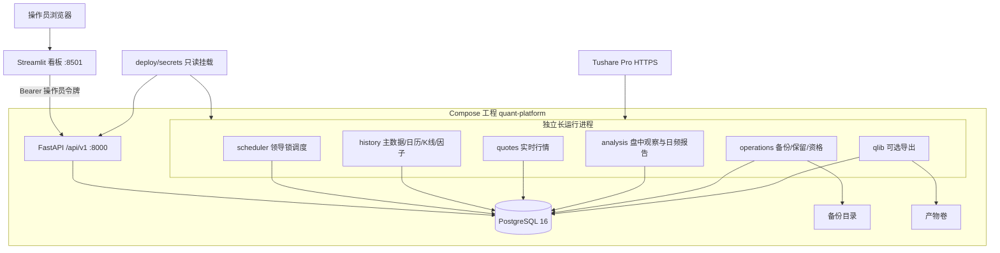

# QUAP 系统架构设计

本文描述 **QUAP 0.1.0** 已经实现的系统架构，而不是规划中的能力。概览见[系统框架](系统框架.md)，部署与开通步骤见[部署说明](部署说明.md)，本次仓库内验证结果见[系统验证报告](系统验证报告.md)。架构图：[architecture.svg](architecture.svg)。

Python 包名是 `quant_platform`，发行名是 `standalone-quant-platform`，命令行入口是 `quant-platform`。要求 Python 3.11 或 3.12。导入本包不会导入 Qlib。

## 1. 定位、目标与非目标

QUAP 是单机、单操作员的 A 股数据采集与篮子研究平台。覆盖科创板、创业板和沪深主板。北京市场不在股票池内。审批由人工完成，系统不提交订单。

**目标**

- 用已授权的 Tushare Pro 采集证券主数据、交易所日历、日 K、复权因子和实时行情。
- 把规范数据与持久任务队列放在 PostgreSQL 16，浏览器关闭后采集与分析仍继续。
- 用原生、可版本化的指标和筛选生成研究报告；篮子修订下一交易日生效。
- 为操作员提供回环绑定的 FastAPI 与 Streamlit 看板，不把供应商密钥交给浏览器。
- 备份、恢复检查、能力探测和实盘资格观察与“容器健康”分开记录。

**非目标**

- 不连接交易网关，不自动再平衡，不承诺收益或净值。
- 不提供 Redis、Kafka、外部调度器、模型训练服务或多租户授权。
- 不把公开行情或合成数据作为生产回退。
- 不把 Qlib 作为原生采集、分析和看板的运行时依赖。
- 单机数据库是单点；本版本不是高可用集群。

## 2. 逻辑架构

分层如下。

| 层 | 职责 | 实现 |
| --- | --- | --- |
| 展示 | 登录、运营、篮子、个股、候选、报告 | `dashboard/app.py`，只调用 API |
| 控制面 | 认证、查询、乐观版本变更、入队 | FastAPI `create_app`，路径 `/api/v1` |
| 领域 | 身份、交易时段、新鲜度、篮子与筛选规则 | `domain`、`analysis` |
| 作业 | 调度、领取、围栏发布、心跳与看门狗 | `jobs.scheduler`、`jobs.worker` |
| 采集 | Tushare 传输、配额、单位与时间戳校验 | `providers.tushare`、`jobs.collect` |
| 存储 | 短事务、租约、数据集水位、分区表 | PostgreSQL + `storage.Database` |
| 适配 | 可选不可变 Qlib 代次 | `adapters.qlib`，独立镜像与子进程 |

看板不挂载数据库或供应商密钥。关闭浏览器不会停止工人；停止 Docker 或让宿主机睡眠会停止采集。

## 3. 物理与进程架构

Compose 工程名是 `quant-platform`。应用容器以 UID 10001 运行，根文件系统只读，临时文件在 `/tmp`。重启策略是 `unless-stopped`；健康检查失败本身不会杀掉仍在运行的进程。工人另有 5 秒心跳、60 秒可续期租约和 1800 秒执行看门狗。停止宽限 90 秒。

| 服务 | 命令 | 接口与持久化 |
| --- | --- | --- |
| `postgres` | PostgreSQL 16.10 | 容器内 5432，**不**映射宿主机；`postgres` 卷 |
| `migrate` | `quant-platform migrate` | Alembic 升到 `0003` 后退出 0 |
| `api` | `api --host 0.0.0.0 --port 8000` | `127.0.0.1:8000`；存活检查 `/health/live` |
| `dashboard` | `dashboard --host 0.0.0.0 --port 8501` | `127.0.0.1:8501`；只读 `QUANT_API_URL` |
| `scheduler` | `worker --role scheduler` | 咨询锁 `77610231`；不领取队列 |
| `history` | `worker --role history` | 主数据、日历、日 K、因子、doctor、refresh |
| `quotes` | `worker --role quotes` | `rt_k` 批次，最多 200 只/任务 |
| `analysis` | `worker --role analysis` | 盘中观察、日频报告、筛选 |
| `operations` | `worker --role operations` | 分区维护、备份、资格采样 |
| `qlib` | `worker --role qlib` | profile `qlib`；`linux/amd64`；4 GiB |

默认应用容器 2 vCPU / 2 GiB。本版本没有按服务拆分的数据库角色。

## 4. 代码布局

| 路径 | 职责 |
| --- | --- |
| `src/quant_platform` | 平台包 |
| `src/quant_platform/cli.py` | 生命周期入口：migrate / api / dashboard / worker / status / doctor / health / import-legacy / restore-check |
| `src/quant_platform/api` | 认证 API |
| `src/quant_platform/dashboard` | Streamlit 客户端 |
| `src/quant_platform/jobs` | 调度、工人、采集、分析作业 |
| `src/quant_platform/storage` | 连接池、围栏发布、Alembic、`schema.sql` |
| `src/quant_platform/providers` | Tushare 边界；禁止公开源回退 |
| `src/quant_platform/analysis` | 原生指标、篮子观察、相对估值筛选、持仓建议；版本 `0.1.0:native-3` |
| `src/quant_platform/adapters/qlib` | 可选导出与隔离读取 |
| `src/quant_platform/legacy.py` | 只读导入旧监控 SQLite |
| `tests` | 夹具测试；PostgreSQL 用例需要 `QUANT_TEST_DATABASE_URL` |
| `deploy` | Dockerfile、Compose、本地密钥准备 |
| `docs` | 架构、部署、验证与架构图 |

## 5. 数据契约

- 规范代码形如 `SH600895`。供应商边界形如 `600895.SH`。六位数字按首位 `6` 映射到 SH，否则 SZ；非法交易所或板块会拒绝。
- 板块：SH `688`/`689` 科创板，SZ `300`/`301` 创业板，SH `600/601/603/605` 与 SZ `000/001/002/003` 主板。
- 原始价格单位是人民币。日成交量是供应商手数乘以 100。日成交额是供应商千元乘以 1000。`rt_k` 的成交量和成交额已经是股数和人民币。
- 复权分析价是 `raw_price * factor(date) / factor(as_of)`。物理成交量不复权。
- 新鲜度要求当前中国交易日，并且源时间戳相对现在在 -5 秒到 120 秒之间。拉取时间 `received_at` 不能代替缺失的 `trade_time`。
- 交易时段只认已验证的上交所、深交所日历交集：09:30–11:30、13:00–15:00。未知日历是 `unverified`，不是按星期几猜测。
- 默认告警覆盖率至少是合格篮子权重的 95%。日频参考代理 `1000 * (1 + weighted_daily_return)` 不是净值或官方指数。

## 6. 数据模型

模式由 `schema.sql` 建立，Alembic `0002` 追加恢复字段，`0003` 追加估值快照与持仓。破坏性降级被禁用，回退靠备份恢复。

**0001 基表**

| 表 | 作用 |
| --- | --- |
| `settings` | 运行设置、探测结果、备份与资格状态；带 `revision` |
| `instruments` | 证券主数据 |
| `calendars` | SSE/SZSE 交易日历 |
| `datasets` | 不可变采集代次，单调 `id` 作为分析水位 |
| `daily_bars` / `factors` | 原始日 K 与正复权因子，按 dataset 保留修订 |
| `quotes` | 按 `collected_at` 范围分区的行情快照 |
| `latest_quotes` | 每只证券最新行情 |
| `baskets` / `basket_revisions` | 篮子头与按生效日的成员修订 |
| `basket_observations` | 分钟级篮子观察 |
| `rules` / `reports` | 筛选规则与 stock/basket/screen 报告 |
| `alerts` / `alert_keys` / `alert_state` | 边沿触发告警与去重 |
| `jobs` | 持久队列：pending/running/complete/blocked/failed |
| `heartbeats` | 工人心跳 |
| `capabilities` | 供应商接口资格 |
| `quota` | 共享账户配额窗口 |
| `audit` / `imports` / `incidents` | 审计、导入幂等、运维事件 |

**0002 追加**

- `jobs.failures`：终态失败次数；配额/依赖等待不增加。
- `baskets.control_revision`：暂停/恢复/归档与成员修订分开做乐观并发。
- `collection_checkpoints`：超限日频按证券断点续传。
- `qualification_samples`：实盘分钟观察，错过的分钟不能补造。

**0003 追加**

- `daily_basics`：按 dataset 保留的 `daily_basic` 估值快照；缺失 PE/PB 保持为空。
- `holdings`：未归档持仓每标的一条，记录成本价和可选数量。
- `holding_observations`：分钟级相对成本观察与研究建议。

数据集分配使用咨询锁 `77610234`，保证钉住的水位不会再出现更小的新 `id`。相同内容哈希复用已有 dataset；内容回退会分配新的更大 `id`，旧修订仍可读。

## 7. 作业与一致性

PostgreSQL 领取使用 `FOR UPDATE SKIP LOCKED`、可续期 60 秒租约、数据库时钟和递增围栏令牌。投递是至少一次；发布效果是幂等的（`jobs.dedupe` 唯一、数据集内容哈希、告警 `event_key`）。

| 作业 kind | 队列 | 作用 |
| --- | --- | --- |
| `calendar` / `directory` | history | 日历与证券主数据 |
| `daily` / `factors` / `basics` / `benchmark` | history | 日 K、因子、估值快照、沪深 300 |
| `doctor` / `refresh` | history | 能力探测；手动刷新日历与名录 |
| `quotes` | quotes | 授权实时行情 |
| `intraday` | analysis | 行情发布后的盘中篮子、持仓与告警 |
| `analyze` | analysis | 钉住输入后的日频报告、估值筛选与持仓建议 |
| `qualification` / `maintenance` / `backup` | operations | 资格采样、分区保留、pg_dump |
| `qlib_export` | qlib | 可选不可变导出 |

调度器每个 tick 尝试领导锁。合格交易时段内，若轮询未暂停且 `rt_k` 未阻塞，则在上一轮完成后等待 `quote_seconds`（默认 30，范围 15–3600）再入队行情。已跟踪篮子成员和未归档持仓优先；名录新鲜时才会扩展到全市场。每个行情任务最多 200 只证券。

失败处理：

- `PermissionDenied`：任务 `blocked`，直到 doctor 重新验证对应能力。
- `Deferred`（配额、未发布的日频、熔断）：推迟且不消耗 `failures`。
- 其它错误：`failures` 加一，达到 10 次变为 `failed`，可由 API 重试。
- 租约过期后其它工人可领取；旧围栏的 `publication` 抛 `LostLease`，效果回滚。

## 8. 采集与分析流水线

1. 每日 08:30 后刷新当日日历与名录；08:30 前刷新上一自然日键，避免过早切日。
2. 历史最多引导 `history_sessions` 个已完成交易日（默认 500，测试夹具可用 120）。近 5 个交易日每天复查，更早日期按自然周核对。未完成的当日 K 线不会被当成已收盘数据。
3. 日频响应 ≥6000 行时改为按证券请求，并写入 `collection_checkpoints`。缺失 K 线保持披露，不推断全天停牌；`suspend_d` 仅作事件记录。
4. 行情工人校验身份集合、完整源日期时间和公司行为参考（昨收相对上一交易日复权），然后在同一围栏事务里写 `quotes`、`latest_quotes` 并入队 `intraday`。
5. 盘中分析对未暂停篮子和未归档持仓写分钟观察。覆盖率不足、过期或未核验的观察不能触发告警，也不能重新武装告警边沿。缺失值 `None` 直接跳过。持仓告警看相对成本涨跌，不用拉取时间当身份。
6. 日频分析在领取后把证券主数据、日历、生效篮子、未归档持仓、规则、历史窗口、分析版本和 dataset 水位写入 `jobs.progress.snapshot`。重试复用该快照，不受中途改名、归档或新 K 线修订影响。日历或 K 线缺口把指标标为 `calendar_gaps`，不会用零填充连成假时间序列。
7. 筛选给出可解释低估候选（行业内与自身历史的 PE_TTM/PB 分位；行业样本不足时退回全市场分位）。亏损或缺失的 PE/PB 不会被当成 0。审批 API 只接受该报告候选的无重复子集，并创建下一交易日生效的新篮子。筛选本身不改篮子。持仓报告给出 `hold` / `review_add` / `review_reduce` / `review_exit`，并带原因和免责声明。

原生指标包括 SMA 5/10/20/60、复权收益 5/20/60、Wilder RSI/ATR、20 日波动、60 日回撤、20 日流动性，以及可选的沪深 300 超额收益。采集、分析和看板不依赖机器学习模型。

## 9. HTTP API 与看板

匿名只开放 `GET /health/live`。`/api/v1/*` 使用单操作员 Bearer 令牌，`hmac.compare_digest` 比较。未配置令牌返回 503。OpenAPI/ReDoc 关闭。未捕获异常对客户端统一为 503，不回传内部细节。

| 方法 | 路径 | 作用 |
| --- | --- | --- |
| GET | `/health/live` | 进程存活 |
| GET | `/api/v1/status` | 运营状态、能力、任务汇总、进程内 API 指标 |
| GET | `/api/v1/boards` | 科创/创业/主板等权覆盖 |
| GET/PUT | `/api/v1/settings` | 持久行情间隔，乐观 `revision` |
| GET | `/api/v1/instruments` | 证券搜索，最多 500 |
| GET | `/api/v1/quotes` | 最新行情并标注 `fresh` |
| GET | `/api/v1/history/{code}` | 原始日 K 与因子 |
| GET/POST/PUT | `/api/v1/baskets` | 列出、创建、编辑篮子 |
| GET | `/api/v1/baskets/{id}/revisions` | 成员修订历史 |
| GET | `/api/v1/baskets/{id}/observations` | 最近 600 条分钟观察 |
| POST | `/api/v1/baskets/{id}/control` | pause / resume / archive |
| GET/POST/PUT | `/api/v1/holdings` | 列出、创建、编辑成本价持仓 |
| GET | `/api/v1/holdings/{id}/observations` | 最近 600 条持仓分钟观察 |
| POST | `/api/v1/holdings/{id}/control` | archive |
| GET/PUT | `/api/v1/rules` | 筛选规则 |
| GET | `/api/v1/reports` | stock / basket / screen / holding |
| POST | `/api/v1/candidates/{id}/approve` | 人工批准候选为新篮子 |
| GET | `/api/v1/alerts` | 最近 200 条告警 |
| GET | `/api/v1/jobs`、`/jobs/{id}` | 任务查询 |
| POST | `/api/v1/jobs/{id}/retry` | 仅重试 `failed` |
| POST | `/api/v1/control` | pause / resume / refresh / analyze / doctor |

看板工作区：Operations（10 秒刷新）、Baskets、Holdings（10 秒刷新）、Stocks、Candidates、Reports。登录只使用操作员令牌。断线时明确提示保留数据不是实盘。建议文案是研究建议，不是下单或收益承诺。

API 延迟与错误计数只覆盖**当前 API 进程**五分钟内最近 1000 次 `/api/v1` 请求，重启后清零。

## 10. 安全与外部依赖

生产行情只依赖 Tushare Pro。传输是校验证书的 HTTPS POST，目标 `https://api.tushare.pro`，关闭重定向和环境代理，响应上限 8 MiB / 60 秒。连续传输失败三次后该接口 `circuit_open` 五分钟。

必需能力：`stock_basic`、`trade_cal`、`daily`、`adj_factor`、`rt_k`。低估筛选还需要 `daily_basic`。可选：`index_daily`、`suspend_d`。`doctor` 按真实访问和返回结构探测；空的必需响应不算通过。`daily_basic` 权限失败不阻塞日 K 采集。付费账户本身不证明接口权限、再分发权利或延迟协议。

四个密钥文件在 `deploy/secrets/`：`postgres_password`、`database_url`、`api_token`、`tushare_token`。它们排除在 Git、`.dockerignore`、发行包和镜像层之外。数据库 URL 形如 `postgresql://quant:<URL编码密码>@postgres:5432/quant`，必须与 PostgreSQL 密码一致。操作员令牌至少 32 字符。

Compose 把界面和 API 绑在回环地址。对公网开放需要单独的 TLS 与认证边界，不要只改绑定地址。

## 11. 配置

环境前缀 `QUANT_`。凭证也支持 `*_FILE` 指向 Docker secrets。

| 变量 | 默认 | 说明 |
| --- | --- | --- |
| `QUANT_DATABASE_URL` | `postgresql://quant@localhost:5432/quant` | 必为 PostgreSQL |
| `QUANT_API_TOKEN` | 空 | 空则 API 拒绝数据面 |
| `QUANT_TUSHARE_TOKEN` | 空 | 空则能力阻塞，不改用公开源 |
| `QUANT_QUOTE_SECONDS` | 30 | 初始间隔；运行中以数据库设置为准 |
| `QUANT_REALTIME_RPM` | 40 | `rt_k` 每分钟上限 |
| `QUANT_ORDINARY_RPM` | 20 | 其它接口每分钟上限 |
| `QUANT_DAILY_QUOTA` | 8000 | 每接口每天上限 |
| `QUANT_HISTORY_SESSIONS` | 500 | 历史窗口 |
| `QUANT_ENVIRONMENT` | `production` | 仅 `production` 或 `test` |
| `QUANT_PROVIDER` | `tushare` | 其它值拒绝启动 |
| `QUANT_QLIB_ENABLED` | false | 同时需要 Compose profile `qlib` |
| `QUANT_ARTIFACT_ROOT` | `.runtime/artifacts` | 容器内 `/data/artifacts` |
| `QUANT_BACKUP_ROOT` | `.runtime/backups` | 容器内 `/backups` |
| `QUANT_API_URL` | 看板用 | 例如 `http://api:8000` |

`provider` 与 `environment` 在 Settings 校验中锁定。测试夹具必须显式 `environment=test`，且禁止外部 HTTP（测试把 `httpx.HTTPTransport.handle_request` 打成失败）。

## 12. Qlib 与旧监控边界

可选 Qlib 需要 `QUANT_QLIB_ENABLED=true` 和 profile `qlib`。真实 `pyqlib==0.9.7` 只装在 AMD64 镜像里；读取在 `python -I` 子进程中。导出是平台自有不可变代次，保留当前和上一份。外部研究数据集只读挂载；命名宇宙必须带日期成分。Qlib 失败不停止原生路径。相邻 Qlib 源码仓库与本平台分开维护。

外部旧监控使用 SQLite 和可选公开行情，独立于本仓库维护，不是内部降级；本平台经 `src/quant_platform/legacy.py` 通过 `import-legacy` 只读导入其运行时。两套进程不能同时拥有同一观察列表的实时采集。导入只读来源、复制实盘告警、排除演示事件，并且不把旧的复权价当成原始 Tushare 价格。本地篮子编辑会产生冲突而不是被覆盖。

## 13. 备份、资格与单机限制

运营作业生成自定义格式 `pg_dump`，SHA-256 校验，保留七份。本地模式使用 Docker 卷 `quant-platform_local-backups`；生产使用 `QUANT_BACKUP_DIRECTORY`。两者都不会自行复制到机外。

`restore-check` 只写入空的 `quant_restore_*` 库，检查 Alembic 版本和 `reports` 可访问，并在校验和匹配时标记 `restore_verified`。它不证明逐行等价，也不给出实测 RTO/RPO。

实盘资格观察要求 `QUANT_ENVIRONMENT=production`，两个已完成交易日各自至少 236 个样本、至少 99% 健康样本，合格市场覆盖至少 95%，并且 scheduler/quotes/history/analysis/operations 心跳健康。延迟任务不能补造错过的分钟。容器健康或夹具测试通过，都不能单独当作生产验收。

## 14. 咨询锁一览

| 锁 | 用途 |
| --- | --- |
| `77610231` | 调度器领导（try lock） |
| `77610232` | 筛选规则修订 |
| `77610233` | 运行时间隔修订 |
| `77610234` | 数据集水位 / 分析快照 / Qlib 导出水位 |
| `hashtextextended(key)` | 告警边沿、配额账户、dataset 范围、legacy 来源 |
