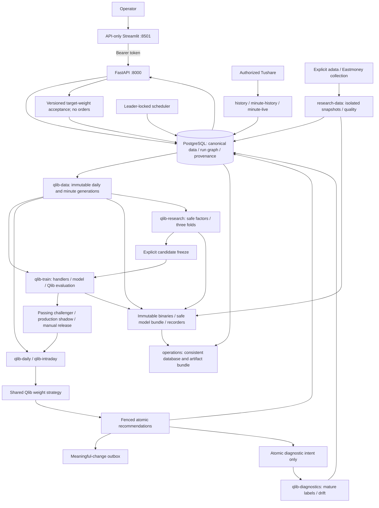

# QUAP 系统架构设计

This document describes the Qlib-centered implementation in the QUAP 0.1.0 working tree, through Alembic `0008`, including isolated supplemental research and diagnostics. Delivery is still in progress; implemented code, fixture validation, and production activation are distinct states. See the [framework](系统框架.md), [deployment guide](部署说明.md), [validation evidence](系统验证报告.md), and [diagram](architecture.svg). The older native-research/ledger roadmap is historical, not the current product contract.

Python 包名是 `quant_platform`，发行名是 `standalone-quant-platform`，命令行入口是 `quant-platform`。要求 Python 3.11 或 3.12。导入本包不会导入 Qlib。

## 1. 定位、目标与非目标

QUAP serves one operator on one machine, covering Shanghai/Shenzhen Main Board, STAR Market, and ChiNext. Qlib owns features, learned predictions, strategy calculations, and simulated evaluation; QUAP owns ingestion, validation, orchestration, presentation, and human decisions.

The primary invariant is that every recommendation references an approved, unexpired Qlib release, passing evaluation, successful prediction, immutable inputs, and versioned policy. Missing prerequisites mean blocked/unavailable, never native fallback. Collection and diagnostic monitoring may remain available.

Outputs are exact target weights with explicit cash. Acceptance changes a model portfolio, not an actual brokerage account. No account balances, executable order quantities, order submission, automated trading, performance promises, or external market-data redistribution are included. “Low price” means low unadjusted nominal share price, not undervaluation.

FastAPI and Streamlit remain lightweight and loopback-bound. PostgreSQL 16 is the canonical store and durable queue. Qlib is required in separate engine processes, not imported by API/UI startup. There is no Redis, Kafka, external orchestrator, public MLflow service, multi-tenancy, or high-availability cluster.

## 2. 逻辑架构

分层如下。

| 层 | 职责 | 实现 |
| --- | --- | --- |
| Presentation | Six research, model, portfolio, and pipeline workspaces | `dashboard/app.py`, `dashboard/workflow.py`; API only |
| 控制面 | 认证、查询、乐观版本变更、入队 | FastAPI `create_app`，路径 `/api/v1` |
| Domain/controller | Identity, sessions, weight/cash contracts, snapshots, release gates | `domain/workflow.py`, `pipeline.py` |
| 作业 | 调度、领取、围栏发布、心跳与看门狗 | `jobs.scheduler`、`jobs.worker` |
| 采集 | Tushare 传输、配额、单位与时间戳校验 | `providers.tushare`、`jobs.collect` |
| 存储 | 短事务、租约、数据集水位、分区表 | PostgreSQL + `storage.Database` |
| Required engine | Qlib data, handlers, training, inference, strategy, evaluations | `adapters/qlib/{data,runtime,strategy}.py` |

看板不挂载数据库或供应商密钥。关闭浏览器不会停止工人；停止 Docker 或让宿主机睡眠会停止采集。

## 3. 物理与进程架构

Compose project `quant-platform` runs application containers as UID 10001 with read-only roots, `/tmp` scratch space, and `unless-stopped`. Health-check failure does not terminate a running container. Workers heartbeat every five seconds and renew 60-second leases. Default deadlines: training 21,600 seconds, data preparation/backup 7,200, inference/shadow 120, other work 1,800. Qlib subprocess diagnostics have a polled 32 MiB bound. Shutdown stops new claims and renews bounded in-flight work; Compose allows 90 seconds before forced termination.

| 服务 | 命令 | 接口与持久化 |
| --- | --- | --- |
| `postgres` | PostgreSQL 16.10 | 容器内 5432，**不**映射宿主机；`postgres` 卷 |
| `migrate` | `quant-platform migrate` | Alembic through `0008`; successful exit 0 |
| `api` | `api --host 0.0.0.0 --port 8000` | `127.0.0.1:8000`；存活检查 `/health/live` |
| `dashboard` | `dashboard --host 0.0.0.0 --port 8501` | `127.0.0.1:8501`；只读 `QUANT_API_URL` |
| `scheduler` | `worker --role scheduler` | 咨询锁 `77610231`；不领取队列 |
| `history` | `worker --role history` | Master, calendars, daily bars/factors, benchmark, risk history, limits, doctor |
| `quotes` | `worker --role quotes` | `rt_k` 批次，最多 200 只/任务 |
| `analysis` | `worker --role analysis` | Legacy quote/basket observations only; native recommendations retired |
| `operations` | `worker --role operations` | 分区维护、备份、资格采样 |
| `minute-history` | `worker --role minute-history` | Scoped historical research/live warm-up bars |
| `minute-live` | `worker --role minute-live` | Finalized bars and same-day recovery |
| `notify` | `worker --role notify` | 把已持久化告警送到操作员自己的 Webhook |
| `qlib-data` | `worker --role qlib-data` | Required AMD64 engine; immutable datasets; 4 GiB |
| `qlib-train` | `worker --role qlib-train` | Required AMD64 engine; training/evaluation; 8 GiB |
| `qlib-daily` | `worker --role qlib-daily` | Required AMD64 daily inference; 4 GiB |
| `qlib-intraday` | `worker --role qlib-intraday` | Required AMD64 intraday inference; 4 GiB |
| `research-data` | `worker --role research-data` | Opt-in research profile; adata only; 1 CPU / 2 GiB / 128 PIDs |
| `qlib-research` | `worker --role qlib-research` | Opt-in development trials; 2 CPUs / 8 GiB / 256 PIDs |
| `qlib-diagnostics` | `worker --role qlib-diagnostics` | Opt-in asynchronous feedback; 2 CPUs / 4 GiB / 256 PIDs |

Default lightweight containers have 2 vCPU / 2 GiB; engine containers have four CPUs. These limits are not measured capacity guarantees. API pools use `quant_read`/`quant_worker` when available; containers still share the configured login credential. Training is isolated from minute inference queues, but they share host resources.

## 4. 代码布局

| 路径 | 职责 |
| --- | --- |
| `src/quant_platform` | 平台包 |
| `src/quant_platform/cli.py` | 生命周期入口：migrate / api / dashboard / worker / status / doctor / health / import-legacy / restore-check |
| `src/quant_platform/api` | 认证 API |
| `src/quant_platform/dashboard` | Streamlit 客户端 |
| `src/quant_platform/jobs` | 调度、工人、采集、分析作业 |
| `src/quant_platform/storage` | 连接池、围栏发布、Alembic、`schema.sql` |
| `src/quant_platform/providers` | Tushare 边界；禁止公开源回退 |
| `src/quant_platform/analysis` | Legacy diagnostics only; not a recommendation/evaluation fallback |
| `src/quant_platform/adapters/qlib` | Required Qlib data, runtime, safe bundles, shared strategy |
| `src/quant_platform/pipeline.py` | Run graph, pinned snapshots, readiness, promotion |
| `src/quant_platform/storage/portfolios.py` | Versioned target weights, cash, watchlist, acceptance |
| `src/quant_platform/storage/artifacts.py` | Consistent database/artifact backup and reference-aware retention |
| `src/quant_platform/research` | Controlled optional adapter, restricted factors, fold execution, metrics, trusted subprocess runner |
| `src/quant_platform/{api,dashboard}/research.py` | Authenticated bounded resources and research-only panels |
| `src/quant_platform/jobs/{supplemental,experiments,diagnostics}.py` | Isolated queues, bounded work, fenced append-only publication |
| `src/quant_platform/storage/{research,experiments}.py` | Permanent replay keys, source/configuration revisions, freeze and artifacts |
| `src/quant_platform/domain/labels.py` | Shared exact daily/minute label windows and adjustment convention |
| `src/quant_platform/legacy.py` | 只读导入旧监控 SQLite |
| `tests` | 夹具测试；PostgreSQL 用例需要 `QUANT_TEST_DATABASE_URL` |
| `deploy` | Dockerfile、Compose、本地密钥准备 |
| `docs` | 架构、部署、验证与架构图 |

## 5. 数据契约

- 规范代码形如 `SH600895`。供应商边界形如 `600895.SH`。六位数字按首位 `6` 映射到 SH，否则 SZ；非法交易所或板块会拒绝。
- 板块：SH `688`/`689` 科创板，SZ `300`/`301` 创业板，SH `600/601/603/605` 与 SZ `000/001/002/003` 主板。
- 原始价格单位是人民币。日成交量是供应商手数乘以 100。日成交额是供应商千元乘以 1000。`rt_k` 的成交量和成交额已经是股数和人民币。
- Canonical raw prices/physical shares stay unchanged. A frozen per-symbol anchor defines `qfactor = source_factor / anchor`; Qlib OHLC/VWAP multiply by qfactor and volume divides by it. `close/factor` restores raw price; `volume*factor` restores shares. Adjusted VWAP × adjusted volume preserves CNY turnover. Zero-volume VWAP remains missing.
- Minute bars carry start/end, observed availability, ingestion time, dataset revision, and finalization. UTC storage maps to Shanghai sessions; no fabricated lunch bars or candles reconstructed from quote snapshots. Historical feature/label availability is validated, not inferred from a current directory.
- Separate immutable daily and five-minute generations include calendar, instruments, anchors, policy, coverage, omissions, and file checksums. Corrections create new runs/generations, not silent rewrites.
- 新鲜度要求当前中国交易日，并且源时间戳相对现在在 -5 秒到 120 秒之间。拉取时间 `received_at` 不能代替缺失的 `trade_time`。
- 交易时段只认已验证的上交所、深交所日历交集：09:30–11:30、13:00–15:00。未知日历是 `unverified`，不是按星期几猜测。
- 默认告警覆盖率至少是合格篮子权重的 95%。日频参考代理 `1000 * (1 + weighted_daily_return)` 不是净值或官方指数。

## 6. 数据模型

`schema.sql` supplies the legacy base; Alembic `0002` adds recovery, `0003` outbox/roles, `0004` the Qlib workflow, `0005` durable request aliases, `0006` isolated supplemental sources, `0007` reproducible experiments, and `0008` diagnostics. Destructive downgrade is disabled; schema rollback requires a verified backup.

**Qlib additions (`0004`/`0005`)**

| Tables | Responsibility |
| --- | --- |
| `security_states`, `market_constraints`, `normalization_anchors` | Versioned dated reference data and frozen normalization |
| `minute_bars` | Typed five-minute records, range-partitioned by bar end |
| `universe_snapshots` | Distinct live frozen pools and dated out-of-sample research pools |
| `pipeline_runs`, `pipeline_steps`, `job_dependencies`, `pipeline_requests` | Pinned run graph, dependency admission, permanent request-key aliases |
| `qlib_generations` | Immutable, checksummed data provenance |
| `model_versions`, `model_evaluations`, `model_shadow_samples`, `model_release_events` | Challenger/active lifecycle, evaluation, shadow, human release decisions |
| `prediction_runs`, `recommendations`, `recommendation_acceptances` | Prediction lineage, validity, exact target weights/cash, idempotent acceptance |
| `scan_policies`, `model_portfolios`, `model_portfolio_revisions`, `watchlist_revisions` | Optimistically versioned user intent |
| `artifact_backups` | Committed backup manifests and protected artifact references |

Migration `0004` labels old reports `legacy_native` and copies existing basket revisions to model-portfolio baselines with explicit zero cash. They are not brokerage holdings. Old candidate approval and basket creation/editing cannot bypass Qlib acceptance.

**Research additions (`0006`–`0008`)**

| Tables | Responsibility |
| --- | --- |
| `research_sources`, `research_collections`, `research_request_attempts`, `research_attempt_outcomes` | Source enablement/revision, explicit scope, durable quotas and attempts |
| `research_snapshots`, `research_quality_checks`, `research_artifacts` | Immutable supplemental observations, diagnostic cross-checks, checksummed references |
| `research_requests` | Permanent mutation-key binding to operation/body/response |
| `factor_definitions`, `factor_sets`, `factor_set_members`, `training_configurations` | Append-only parent revisions, ordered safe expressions, immutable backend/label/windows |
| `research_experiments`, `research_trials`, `research_trial_results` | Frozen canonical inputs, every fenced attempt and result, owned recorders |
| `research_freezes`, `research_test_exposures` | Explicit validation-based selection and held-out test exposure lineage |
| `diagnostic_inputs`, `model_diagnostics` | Frozen observation revisions, append-only model/prediction/metric/source evidence |

Reader grants are SELECT-only; worker grants on immutable research evidence are SELECT/INSERT. Source enablement changes append a revision with expected-revision checks. New indexes and unique constraints bind trial fences and diagnostic revisions. These are role boundaries within a shared configured database login, not separate service identities.

**0001 基表**

| 表 | 作用 |
| --- | --- |
| `settings` | 运行设置、探测结果、备份与资格状态；带 `revision` |
| `instruments` | 证券主数据 |
| `calendars` | SSE/SZSE 交易日历 |
| `datasets` | 不可变采集代次，单调 `id` 作为分析水位 |
| `daily_bars` / `factors` | 原始日 K 与正复权因子，按 dataset 保留修订 |
| `quotes` | 按 `collected_at` 范围分区的行情快照 |
| `latest_quotes` | 每只证券最新行情 |
| `baskets` / `basket_revisions` | 篮子头与按生效日的成员修订 |
| `basket_observations` | 分钟级篮子观察 |
| `rules` / `reports` | 筛选规则与 stock/basket/screen 报告 |
| `alerts` / `alert_keys` / `alert_state` | 边沿触发告警与去重 |
| `jobs` | 持久队列：pending/running/complete/blocked/failed |
| `heartbeats` | 工人心跳 |
| `capabilities` | 供应商接口资格 |
| `quota` | 共享账户配额窗口 |
| `audit` / `imports` / `incidents` | 审计、导入幂等、运维事件 |

**0002 追加**

- `jobs.failures`：终态失败次数；配额/依赖等待不增加。
- `baskets.control_revision`：暂停/恢复/归档与成员修订分开做乐观并发。
- `collection_checkpoints`：超限日频按证券断点续传。
- `qualification_samples`：实盘分钟观察，错过的分钟不能补造。

**0003 追加**

- `alert_outbox`：已写入的告警外送队列。外送失败不删除告警。
- 数据库角色 `quant_read`（只读）和 `quant_worker`（写入）。迁移仍用登录用户。角色不存在时连接保持原登录用户。

数据集分配使用咨询锁 `77610234`，保证钉住的水位不会再出现更小的新 `id`。相同内容哈希复用已有 dataset；内容回退会分配新的更大 `id`，旧修订仍可读。

## 7. 作业与一致性

PostgreSQL 领取使用 `FOR UPDATE SKIP LOCKED`、可续期 60 秒租约、数据库时钟和递增围栏令牌。投递是至少一次；发布效果是幂等的（`jobs.dedupe` 唯一、数据集内容哈希、告警 `event_key`）。

| 作业 kind | 队列 | 作用 |
| --- | --- | --- |
| `calendar` / `directory` | history | 日历与证券主数据 |
| `daily` / `factors` / `benchmark` | history | 日 K、因子、沪深 300 |
| `doctor` / `refresh` | history | 能力探测；手动刷新日历与名录 |
| `quotes` | quotes | 授权实时行情 |
| `intraday` | analysis | 行情发布后的盘中篮子与告警 |
| `security_history` / `constraints` | history | Dated risk states and limits/suspensions |
| `minute_history` | minute-history | Scoped historical bars and rolling warm-up |
| `minute_live` / `minute_repair` | minute-live | Finalized bars and same-day gap recovery |
| `qlib_prepare` | qlib-data | Validate immutable generation and feature coverage |
| `qlib_train` | qlib-train | Train distinct daily/minute model, evaluate, seal artifacts |
| `qlib_infer` / `qlib_shadow` | qlib-daily or qlib-intraday | Predict, apply shared strategy, publish or observe |
| `research_collect` | research-data | Explicit supplemental scope; no production watermarks |
| `qlib_experiment` | qlib-research | Three development folds per baseline/candidate; no model activation |
| `qlib_diagnostics` | qlib-diagnostics | Immutable drift and calendar-mature realized labels |
| `qualification` / `maintenance` / `backup` | operations | Legacy monitoring observations, retention, database/artifact bundles |
| `notify` | notify | 发送 `alert_outbox` 中尚未送达的告警 |

调度器每个 tick 尝试领导锁。合格交易时段内，若轮询未暂停且 `rt_k` 未阻塞，则在上一轮完成后等待 `quote_seconds`（默认 30，范围 15–3600）再入队行情。已跟踪篮子成员优先；名录新鲜时才会扩展到全市场。每个行情任务最多 200 只证券。

失败处理：

- `PermissionDenied`：任务 `blocked`，直到 doctor 重新验证对应能力。
- `Deferred`（配额、未发布的日频、熔断）：推迟且不消耗 `failures`。
- 其它错误：`failures` 加一，达到 10 次变为 `failed`，可由 API 重试。
- 租约过期后其它工人可领取；旧围栏的 `publication` 抛 `LostLease`，效果回滚。

## 8. Qlib pipelines, strategy, and release qualification

### Collection and preparation

Daily scheduling refreshes references, then completed daily/factor/constraint partitions and CSI 300. The 18:30 trigger is not proof of source readiness. Defaults are 1,500 completed daily sessions and 252 historical minute-pool sessions. Recent daily partitions revalidate each day; older partitions use weekly identities. Missing rows remain unknown, not inferred suspensions.

Historical minutes use `stk_mins` (`5min`); live/recovery use `rt_min` and `rt_min_daily` (`5MIN`) with endpoint-specific schemas/limits. Research pools contain dated out-of-sample daily shortlists and exact daily weights/cash. The scheduler records exact bounded collection jobs for each historical member with preceding 20-session context and following-session evaluation context. Closed-month requests have stable ranges; the current month uses completed dates. Weekly minute training waits for these jobs, not an unrelated minute watermark.

Preparation separately verifies actual data: complete contiguous feature windows, dated risk/limits, coverage, and every historical daily target. All 48 bars of an active session must qualify; becoming ready only at the close is insufficient. Incomplete-window labels are removed. Coverage is computed per dated pool, not against today's union. Historical coverage and omissions are recorded in manifests.

### Separate model workflows

| Property | Daily | Five-minute |
| --- | --- | --- |
| Handler / model | Alpha158 / DatasetH / LGBModel | Custom DataHandlerLP / DatasetH / LGBModel |
| Train / validation / test | 756 / 252 / 252 sessions | 120 / 40 / 60 sessions |
| Label | `Ref($open,-6)/Ref($open,-1)-1` | Future permitted reference open to next-session close |
| Retraining | Monthly challenger | Weekly challenger |
| Maximum age | 35 calendar days | 14 calendar days |

Purge label overlap at split boundaries. ProcessInf → training-fitted RobustZScoreNorm → Fillna are reused without fitting during inference; DropnaLabel is learning-only. Qlib SignalRecord, SigAnaRecord, and PortAnaRecord persist signal and simulated portfolio evaluations. Recorders are sealed into the backup reference graph. Initial LightGBM defaults are MSE, learning rate 0.05, 31 leaves, seed 42, four threads, up to 1,000 rounds and 50-round early stopping—not validated investment parameters.

Daily release gates include positive held-out Rank IC, positive net excess return, drawdown no worse than 20%, provenance, coverage, and historical-pool qualification. The minute overlay cannot degrade matching daily-only cost-adjusted return or drawdown. Promotion additionally requires 20 healthy production shadow trading sessions in the preceding 60-day workflow lineage, this candidate's own passing evaluation and healthy production session within that same window, freshness, and manual approval. Both exchanges must mark each evidence day open; the current Shanghai date and future dates are excluded. Intraday health requires all 44 eligible five-minute cutoffs (09:35–11:20 and 13:05–14:50); duplicates, other dates/environments, and non-shadow predictions do not fill missing slots. Daily evidence requires the completed 15:00 cutoff and observation before the next session opens. Missing cutoffs are recorded for inspection. Changing policy/feature/strategy lineage does not inherit unrelated evidence. Tests cannot qualify production.

### Shared strategy and publication

A WeightStrategyBase extension supplies both simulation and live proposals. Qualified positive scores determine proportional target weights: at most 20 names, 5% per name, at least 5% cash. Unallocated cash is retained. A 0.5-percentage-point band suppresses cosmetic changes. The intraday model retains or halves daily targets using a validation-fitted threshold; it neither exceeds the daily target nor introduces daily-rejected stocks.

The scan uses raw price >0 and ≤CNY 10, at least 120 listed sessions, CNY 20 million average 20-session turnover, and verified risk/tradability. Qlib scores rank eligible names. The price ceiling never forces an above-ceiling portfolio holding to exit. Missing existing holdings block the portfolio proposal instead of inventing exits. Standalone stock views omit context-free weights and actions.

ChinaExchange models dated limits, costs, board lots, and simulated T+1. Lot rules apply again after cash/volume clipping; full odd-lot exits remain possible. These are simulated-account constraints, not knowledge of a user's sellable positions.

Daily inference publishes next-session proposals and shortlist. The live minute pool prioritizes model portfolios/watchlist, then up to 200 shortlist stocks, with a 300-stock cap. Explicit selections over capacity are rejected; omitted shortlist names are disclosed. New members warm up. Intraday proposals pin valid daily baseline reports, publish by bar-end +120 seconds, and become effective at a later five-minute boundary. Expiry is the earliest of supersession, bar-end +7 minutes, or session close. Signals cannot cross lunch/overnight execution boundaries. Daily-only reports remain separately labeled when intraday is unavailable.

Run creation freezes source watermarks, references, universe, model, policy, and portfolio revisions. Request aliases persist even when equivalent inputs reuse another run. Parents must succeed before child jobs can claim. Artifacts are written/checksummed before fenced transactional publication; release and revision validity are rechecked under the publication lock. Failures cannot expose partially published reports.

Meaningful target/action changes write a durable outbox event in the publication transaction, with context-specific deduplication and a five-minute cooldown. Delivery rechecks report/model/policy and intraday baseline validity. Stale events are terminally skipped; failures remain pending. The message points to the current report and states that no orders were sent.

### Supplemental data and safe research

`adata==2.9.5` is lazily imported only in the separate research-data environment. QUAP uses source-specific Eastmoney methods, raw adjustment, allowlisted HTTPS hosts/paths, certificate verification, no redirects or environment proxy, one request per adapter invocation, and bounded subprocess deadlines/body sizes. Defaults are one collection job, ten requests/minute, three attempts, 60 seconds, 8 MiB, and 50 selected stocks. The pinned daily method requests HTTP and is explicitly unavailable rather than downgraded. Intraday is current-session only; no historical minute qualification is inferred.

Normalized snapshots retain source revision, scope, retrieval/event times, payload checksum, units, row counts, quality, and unknown historical availability. adata already converts lots to shares; QUAP does not multiply twice. Invalid, duplicate, nonfinite, inconsistent OHLC, out-of-session/range, or incomplete rows are quarantined. Cross-checks compare matching raw observations to Tushare; same-day minutes require complete one-minute groups and finalized cutoffs. Both exchanges must agree on calendars. Diagnostic warnings use price > max(CNY 0.01, 0.1%) and volume/amount >1%; they never correct canonical tables or qualify pools/models.

Factors accept fields and arithmetic plus Abs, Log, past Ref/Delta, Mean, Std, Sum, Min, Max, and Corr. The parser limits expressions to 2,048 characters, depth 16, 256 tokens, windows 1–252, and bounded warm-up; arbitrary Python, attributes, labels, imports, and future references are rejected. Custom feature sets are daily-only; the minute contract is unchanged. Three fixed-size chronological development folds fit processors on training samples only, purge six daily sessions or one minute session, and reserve the existing final test. Insufficient history is rejected, not shortened.

Experiments pin canonical generation checksums, configuration/feature order, label/seed/windows, code hashes, and dependency versions. Every attempted trial is durable; lease-loss/cancel fences reject stale publication and successful verified folds can be reused. Freezing requires six successful trials and matching execution identity. Challenger creation uses the original frozen generation/configuration and records held-out exposure; a reused holdout is not fresh unbiased evidence. Freeze and experiment completion cannot produce active models, target weights, or orders.

### Asynchronous diagnostics

Training saves raw-feature/score histograms and LightGBM gain importance; no live-derived replacement baseline is fabricated for old models. Prediction publication writes diagnostic job intent atomically, with expensive calculations outside the 120-second inference path. Follow-up scheduling checks at most 25 predictions per five minutes in a 180-day window, stops at 1,000 queued/running jobs, and keys work by relevant source revisions rather than unrelated global watermark changes. Retries reuse frozen observations; matching verified drift artifacts are reused when only labels change.

Exact daily labels enter at next-session open and exit at the sixth subsequent session open. Minute labels use the permitted future entry-bar open (bar end cutoff +10 minutes) and next-session close. Calendar agreement, original scored universe, frozen canonical revisions, corporate-action factors, suspension/volume checks, and maturity are shared with training conventions. Fewer than 30 valid pairs, constant scores/labels, or missing future observations produce `insufficient_data`, not zero IC. Minute quality is aggregated by session; rolling 20/60-session results disclose missing sessions.

PSI uses ten training-quantile bins (collapsed for repeated edges), missing/underflow/overflow handling, epsilon smoothing, and explicit constant-feature handling. Minute drift requires matching time-of-day cohorts. The 0.1/0.25 thresholds are informational; diagnostics cannot retrain, rank stocks, change targets, promote, or bypass release gates. Trusted subprocesses receive no database/provider/API credentials. They are not sandboxes for arbitrary generated code; RD-Agent, paid LLMs, and multi-agent data egress remain a separately gated later stage.

## 9. HTTP API 与看板

匿名只开放 `GET /health/live`。`/api/v1/*` 使用单操作员 Bearer 令牌，`hmac.compare_digest` 比较。未配置令牌返回 503。OpenAPI/ReDoc 关闭。未捕获异常对客户端统一为 503，不回传内部细节。

| 方法 | 路径 | 作用 |
| --- | --- | --- |
| GET | `/health/live` | 进程存活 |
| GET | `/api/v1/status` | 运营状态、能力、任务汇总、进程内 API 指标 |
| GET | `/api/v1/boards` | 科创/创业/主板等权覆盖 |
| GET/PUT | `/api/v1/settings` | 持久行情间隔，乐观 `revision` |
| GET | `/api/v1/instruments` | 证券搜索，最多 500 |
| GET | `/api/v1/quotes` | 最新行情并标注 `fresh` |
| GET | `/api/v1/history/{code}` | 原始日 K 与因子 |
| GET | `/api/v1/baskets` | Legacy monitoring records; create/edit return 410 |
| GET | `/api/v1/baskets/{id}/revisions` | 成员修订历史 |
| GET | `/api/v1/baskets/{id}/observations` | 最近 600 条分钟观察 |
| POST | `/api/v1/baskets/{id}/control` | pause / resume / archive |
| GET | `/api/v1/reports` | Read-only legacy-native archive |
| POST | `/api/v1/candidates/{id}/approve` | Retired; returns 410 |
| GET | `/api/v1/data-readiness`, `/qlib-generations` | Daily/minute blockers, history readiness, immutable generations |
| GET/POST | `/api/v1/pipeline-runs` | Query or explicitly request pinned work; POST returns 202 |
| GET/POST | `/api/v1/pipeline-runs/{id}`, `/{id}/retry` | Graph inspection / scoped retry with pinned inputs |
| POST | `/api/v1/model-training-runs` | Explicit `purpose=training`; never triggered by report reads |
| GET/POST | `/api/v1/models`, `/{id}/promote`, `/{id}/rollback` | Models/evaluations and qualified manual release actions |
| GET | `/api/v1/models/{id}/shadow-observations` | Dated shadow evidence |
| GET/PUT | `/api/v1/scan-policy`, `/watchlist` | Versioned policy and explicit symbols |
| GET/POST/PUT | `/api/v1/model-portfolios`, `/{id}` | Versioned weights/cash; revisions under `/{id}/revisions` |
| GET | `/api/v1/recommendations`, `/{id}`, `/stock/{code}` | Frequency/validity/context-filtered proposals and provenance |
| POST | `/api/v1/recommendations/{id}/accept` | Idempotent version-checked acceptance; model-portfolio revision only |
| GET | `/api/v1/alerts` | 最近 200 条告警 |
| GET | `/api/v1/jobs`、`/jobs/{id}` | 任务查询 |
| POST | `/api/v1/jobs/{id}/retry` | 仅重试 `failed` |
| POST | `/api/v1/control` | Operational pause/resume/refresh/doctor; retired generic analysis is not a bypass |
| GET/PUT | `/api/v1/research-sources`, `/{source_id}` | Catalog, health, explicit terms acknowledgment and revision |
| GET/POST | `/api/v1/research-collections` | Bounded explicit jobs; POST returns 202 |
| GET | `/api/v1/research-snapshots`, `/{id}`, `/research-quality` | Paginated immutable snapshots and diagnostic differences |
| GET/POST | `/api/v1/factors`, `/factor-sets`, `/training-configurations` | Bounded lists and immutable revisions; built-in `/factors/inventory` |
| GET/POST | `/api/v1/research-experiments`, `/{id}`, `/{id}/freeze` | Development jobs, attempts, explicit frozen selection |
| GET | `/api/v1/research-experiments/{id}/trials/{trial_id}/diagnostics` | Verified validation-only factor distribution/correlation and paginated IC stability |
| POST | `/api/v1/research-jobs/{id}/cancel`, `/{id}/retry` | Expected-fence controls with permanent request-key replay |
| GET | `/api/v1/models/{id}/diagnostics`, `/research-stocks/{code}/scores` | Mature-label/drift evidence and historical Qlib-only scores/ranks |

Six API-only workspaces: Overview; My Model Portfolio; Stock Research; Low-Price Scan; Models & Validation; Data & Pipeline. The first-use path is capabilities → policy/baseline → history → Qlib preparation → training/evaluation → shadow → manual promotion. Data refresh, inference, and training are distinct actions. Acceptance preserves exact selected weights/cash, requires current expected revisions and a still-future effective time, and never submits orders. Disconnects and unavailable prerequisites are explicit.

Research lists are bounded (normally 25/default, 100/max); stock scores allow 500 and factor stability 252 per page. Mutations require permanent request keys and expected revisions. Generic job retry cannot bypass isolated research controls. GET does not enqueue work. Data & Pipeline adds source/quality panels; Models & Validation adds factors/configurations, development curves, freeze/challenger, drift, and importance. Stock Research separates canonical OHLC/volume and Qlib score history from supplemental evidence. No experimental Accept action exists.

API 延迟与错误计数只覆盖**当前 API 进程**五分钟内最近 1000 次 `/api/v1` 请求，重启后清零。

## 10. 安全与外部依赖

生产行情只依赖 Tushare Pro。传输是校验证书的 HTTPS POST，目标 `https://api.tushare.pro`，关闭重定向和环境代理，响应上限 8 MiB / 60 秒。连续传输失败三次后该接口 `circuit_open` 五分钟。

Daily Qlib capabilities: `stock_basic`, `trade_cal`, `daily`, `adj_factor`, `index_daily`, `namechange`, `stk_limit`, `suspend_d`. Intraday additionally requires `stk_mins`, `rt_min`, `rt_min_daily`; quote monitoring separately requires `rt_k`. Doctor verifies actual access/schema and reports per-frequency missing capabilities. Empty mandatory data responses do not prove readiness; suspension events may legitimately be empty. A paid account does not prove entitlement, historical availability, latency, or redistribution rights.

四个密钥文件在 `deploy/secrets/`：`postgres_password`、`database_url`、`api_token`、`tushare_token`。它们排除在 Git、`.dockerignore`、发行包和镜像层之外。数据库 URL 形如 `postgresql://quant:<URL编码密码>@postgres:5432/quant`，必须与 PostgreSQL 密码一致。操作员令牌至少 32 字符。

Compose 把界面和 API 绑在回环地址。对公网开放需要单独的 TLS 与认证边界，不要只改绑定地址。

## 11. 配置

环境前缀 `QUANT_`。凭证也支持 `*_FILE` 指向 Docker secrets。

| 变量 | 默认 | 说明 |
| --- | --- | --- |
| `QUANT_DATABASE_URL` | `postgresql://quant@localhost:5432/quant` | 必为 PostgreSQL |
| `QUANT_API_TOKEN` | 空 | 空则 API 拒绝数据面 |
| `QUANT_TUSHARE_TOKEN` | 空 | 空则能力阻塞，不改用公开源 |
| `QUANT_QUOTE_SECONDS` | 30 | 初始间隔；运行中以数据库设置为准 |
| `QUANT_REALTIME_RPM` | 40 | `rt_k` 每分钟上限 |
| `QUANT_ORDINARY_RPM` | 20 | 其它接口每分钟上限 |
| `QUANT_DAILY_QUOTA` | 8000 | 每接口每天上限 |
| `QUANT_HISTORY_SESSIONS` | 1500 | Completed daily source sessions |
| `QUANT_MINUTE_HISTORY_SESSIONS` | 252 | Historical research-pool sessions |
| `QUANT_INTRADAY_POOL_CAPACITY` | 300 | Maximum supported explicit/live pool size |
| `QUANT_MINUTE_RPM` / `QUANT_MINUTE_DAILY_QUOTA` | 40 / 8000 | Endpoint-specific minute request budgets |
| `QUANT_TRAINING_DEADLINE_SECONDS` | 21600 | Bounded training task budget |
| `QUANT_DATA_DEADLINE_SECONDS` | 7200 | Preparation/backup worker budget |
| `QUANT_INFERENCE_DEADLINE_SECONDS` | 120 | Inference/shadow task budget; ≤120 |
| `QUANT_ENVIRONMENT` | `production` | 仅 `production` 或 `test` |
| `QUANT_PROVIDER` | `tushare` | 其它值拒绝启动 |
| `QUANT_RESEARCH_DATA_ENABLED` | false | Separate deployment opt-in; source terms acknowledgment still required |
| `QUANT_RESEARCH_RPM` / `QUANT_RESEARCH_ATTEMPTS` | 10 / 3 | Bounded persistent research quota and attempts |
| `QUANT_RESEARCH_REQUEST_DEADLINE_SECONDS` / `QUANT_RESEARCH_RESPONSE_BYTES` | 60 / 8388608 | Supplemental request deadline and body cap |
| `QUANT_QLIB_ENABLED` | true | Compatibility guard; false is rejected, no optional profile |
| `QUANT_ARTIFACT_ROOT` | `.runtime/artifacts` | 容器内 `/data/artifacts` |
| `QUANT_BACKUP_ROOT` | `.runtime/backups` | 容器内 `/backups` |
| `QUANT_BACKUP_REPLICA_ROOT` | 空 | 与主备份不同目录的副本；空则只保留主备份 |
| `QUANT_OBSERVATION_ROOT` | `.runtime/observations` | 进程外 API 事件日志；容器内 `/data/observations` |
| `QUANT_NOTIFY_WEBHOOK` | 空 | 操作员自己的告警 Webhook；空则 notify 作业不外送 |
| `QUANT_API_URL` | 看板用 | 例如 `http://api:8000` |

`provider` 与 `environment` 在 Settings 校验中锁定。测试夹具必须显式 `environment=test`，且禁止外部 HTTP（测试把 `httpx.HTTPTransport.handle_request` 打成失败）。

## 12. Qlib 与旧监控边界

The standard Compose deployment requires four engine workers using pinned `pyqlib==0.9.7` and `lightgbm==4.7.0`. The packaging extra keeps engine dependencies out of API/UI/ingestion images; it does not make Qlib optional. Work runs in bounded subprocesses. ARM emulation is suitable for development only until measured capacity proves otherwise.

Live inference loads LightGBM text, JSON metadata, and numeric NPZ (`allow_pickle=False`) and reconstructs only known fitted processor classes. It does not unpickle model uploads; no upload API exists. Qlib recorders are filesystem artifacts without a public MLflow service. External research inputs remain read-only. An engine outage blocks recommendations, not basic data collection/diagnostics.

外部旧监控使用 SQLite 和可选公开行情，独立于本仓库维护，不是内部降级；本平台经 `src/quant_platform/legacy.py` 通过 `import-legacy` 只读导入其运行时。两套进程不能同时拥有同一观察列表的实时采集。导入只读来源、复制实盘告警、排除演示事件，并且不把旧的复权价当成原始 Tushare 价格。本地篮子编辑会产生冲突而不是被覆盖。

## 13. 备份、资格与单机限制

Operations exports a PostgreSQL repeatable-read snapshot shared with `pg_dump`, enumerates every database-referenced generation/model/recorder and research snapshot/trial/diagnostic artifact, verifies file manifests, and publishes a `quap-snapshot-v1` tar with `database.dump`, artifacts, and SHA-256 manifest. It retains seven committed owned bundles. Legacy `.dump` files remain untouched but are not supported by the new restore path. Local volumes share the host failure domain; configure and verify off-host replication separately.

`restore-check` requires an empty `quant_restore_*` database and a new isolated artifact destination. It rejects malformed archives, links, duplicate/traversal/unlisted entries, and checksum mismatches before database restore. Restored artifact references must exactly match the archived manifest; files become the restored artifact root only after validation. `--fault-at` records observed RPO/RTO differences, not a promised objective. Treat backup files as trusted operator inputs: checksums detect corruption, not malicious replacement of both payload and manifest.

Retention conservatively preserves all database references and retained-backup references. Abandoned owned generation/model/research directories and recorders are pruned after the task grace period and only when no Qlib work is running, with a 100-directory limit per pass. New recorders receive a checksummed `quap-owner.json` marker before training. Recorder cleanup requires that exact ownership marker; legacy/unmarked recorders, experiment metadata, malformed markers, and symlinks remain untouched. Workflow/dependency and minute-history checkpoints survive ordinary job retention. Disk monitoring remains necessary.

The legacy two-session quote-observation metric remains separate from Qlib release gates. Production activation still needs verified entitlements and point-in-time history, passing model performance, 20-session production shadow qualification, measured five-minute latency/capacity, and off-host recovery. Fixtures and healthy containers cannot establish these conditions.

## 14. 咨询锁一览

| 锁 | 用途 |
| --- | --- |
| `77610231` | 调度器领导（try lock） |
| `77610232` | 筛选规则修订 |
| `77610233` | 运行时间隔修订 |
| `77610234` | Source dataset watermark and pinned snapshots |
| `77610242` | Historical minute-pool scheduling checkpoint |
| `77610243` | Artifact backup/retention lifecycle |
| `77610260` | Permanent research mutation replay and revision serialization |
| `77610261` | Supplemental collection quota/attempt reservation |
| `hashtextextended(key)` | Alert edges, recommendation notifications, quotas, dataset scope, legacy import |

## 15. Remaining qualification work

Current evidence and exact commands belong in the validation report. Remaining delivery checks include broader browser journeys, end-to-end dynamic historical-pool minute training from canonical data, and production point-in-time availability qualification. Shadow-session completeness/failure and recorder-retention regression cases now pass in isolation. Documentation of a gate is not evidence that the gate has passed.
