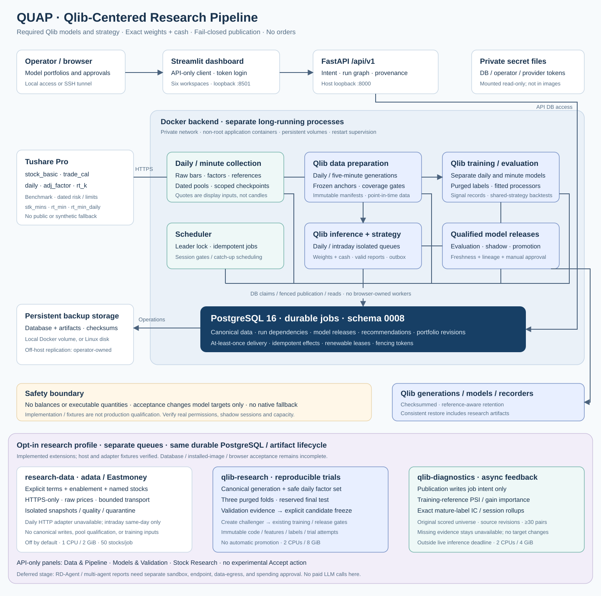
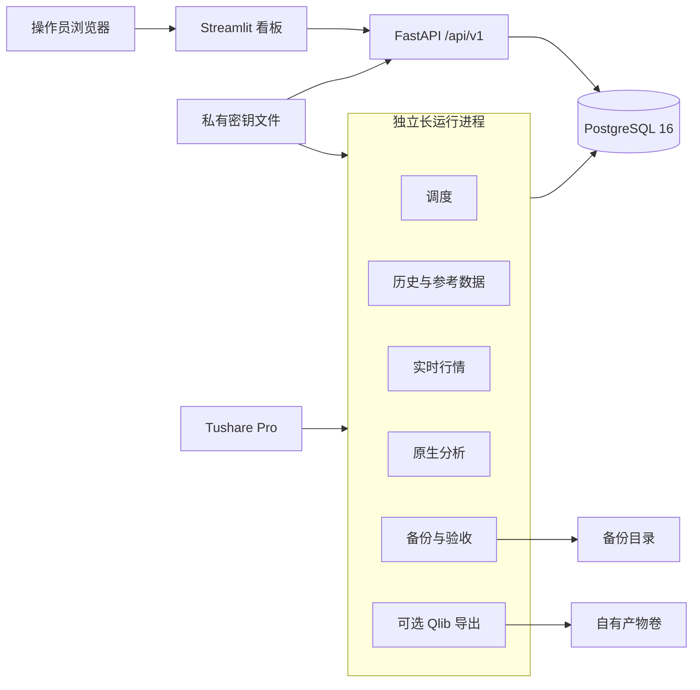

# 系统框架

QUAP 是单机、单操作员的 A 股数据采集与篮子研究平台。本文描述已经实现的进程、存储和数据契约。它是研究与监控系统，审批由人工完成，不连接交易网关，也不承诺收益或行情再分发。

架构图：

## 代码布局

| 路径 | 职责 |
| --- | --- |
| `src/quant_platform` | 平台包。导入本包不会导入 Qlib |
| `tests` | 平台测试。PostgreSQL 用例需要 `QUANT_TEST_DATABASE_URL` |
| `deploy` | Dockerfile、Compose 和本地密钥准备脚本 |
| `docs` | 本框架说明、部署说明和架构图 |
| `legacy` | 迁出 Qlib 前的公开行情监控，仅用于迁移和回滚 |

命令行入口是 `quant-platform`。包版本 `0.1.0`，要求 Python 3.11 或 3.12。

## 进程与存储

Compose 工程名是 `quant-platform`。每个应用容器以 UID 10001 运行，根文件系统只读，临时文件放在 `/tmp`。Docker 在容器退出后按 `unless-stopped` 重启；健康检查失败本身不会重启仍在运行的进程。工人进程另有心跳、租约续期和 1800 秒执行看门狗。

| 服务 | 职责 | 持久化与接口 |
| --- | --- | --- |
| `postgres` | PostgreSQL 16，规范数据和持久任务队列 | 容器内 5432，不映射到宿主机；`postgres` 卷 |
| `migrate` | 启动前一次性 Alembic 迁移 | 模式版本 0002；退出码 0 表示成功 |
| `api` | 带认证的控制与查询 API，乐观版本检查 | 宿主机 `127.0.0.1:8000`，路径 `/api/v1`，Bearer 令牌 |
| `dashboard` | Streamlit API 客户端，人工编辑篮子和审批 | 宿主机 `127.0.0.1:8501`；不挂载数据库或供应商密钥 |
| `scheduler` | 领导锁调度、交易时段和补跑 | PostgreSQL 任务身份和持久化运行设置 |
| `history` | 证券主数据、日历、K 线、复权因子、基准和 doctor | 不可变数据集；可恢复的采集检查点 |
| `quotes` | 已授权实时行情、源日期和公司行为核对 | 带时间戳的行情；随后发布盘中任务 |
| `analysis` | 盘中篮子与告警，以及日频原生分析与筛选 | 带版本的观察、报告、告警键和状态 |
| `operations` | 备份、保留、事件和实盘资格观察 | 持久备份目录；运行状态在 PostgreSQL |
| `qlib` | 不可变导出和隔离的真实 Qlib 读取 | 单独的 AMD64 镜像；自有 `artifacts` 代次 |

本版本没有 Redis、Kafka、外部调度器、交易网关或模型训练服务。单机数据库是单点。关闭浏览器不会停止后端；停止 Docker 或让宿主机睡眠会停止采集。

## 采集与分析

1. 调度器核对已验证的上交所、深交所日历，并刷新证券名录。支持科创板、创业板和沪深主板。北京市场不在本平台股票池内。
2. 在合格交易时段内，每个行情任务最多 200 只证券，已跟踪篮子成员优先。默认间隔是上一轮完成后的 30 秒，不是全市场 30 秒延迟保证。共享账户配额会拉长周期。
3. 行情工人通过校验证书的 Tushare HTTPS 接口核对身份、完整源日期时间、价格和公司行为参考，然后在同一次围栏事务里发布行情和下游盘中任务。
4. 盘中分析计算合格权重篮子收益和日频参考代理，保存分钟观察并评估持久告警。缺失或过期的观察不能触发告警，也不能重新武装告警边沿。
5. 历史采集最多引导 500 个已完成交易日，近日期优先。最近五个交易日每天复查，更早日期每周核对。日 K 保持原始价格，复权因子单独存放。
6. 日频分析固定已提交数据集水位、证券主数据、日历、生效篮子修订、规则、历史窗口和分析版本。重试复用该快照。日历或 K 线缺口会抑制受影响交易日的指标，而不会把观察压成一条虚假时间序列。
7. 筛选给出可解释候选。审批是人工操作，并创建下一交易日生效的新篮子修订。审批不发出订单，也不静默再平衡已有篮子。

看板每十秒刷新运营页和篮子观察。其他视图由操作员显式加载。

## 数据契约

- 规范代码形如 `SH600895`。供应商边界形如 `600895.SH`。
- 原始价格单位是人民币。日成交量是供应商手数乘以 100。日成交额是供应商千元乘以 1000。`rt_k` 的成交量和成交额已经是股数和人民币。
- 复权分析价是 `raw_price * factor(date) / factor(as_of)`。物理成交量不复权。
- 新鲜度要求当前中国交易日，并且源数据年龄在 -5 秒到 120 秒之间。拉取时间不能代替缺失的源时间。
- 默认告警覆盖率至少是合格篮子权重的 95%。日频参考代理 `1000 * (1 + weighted_daily_return)` 既不是净值，也不是官方指数。
- 原生指标包括移动平均、复权收益、Wilder RSI/ATR、波动率、回撤、流动性和可选的沪深 300 比较。采集、分析和看板不依赖机器学习模型。
- PostgreSQL 领取使用 `FOR UPDATE SKIP LOCKED`、可续期的 60 秒租约、数据库时钟和递增围栏令牌。投递是至少一次；发布效果是幂等的。
- 权限错误会阻塞任务，直到 doctor 重新验证该能力。配额和依赖等待会推迟任务，不消耗终态失败次数。
- 成员修订与暂停、恢复、归档控制使用各自的乐观修订。历史生效名称来自对应的成员修订。
- 固定的重试快照不是完整版本化的历史证券主数据服务。API 请求指标限制在进程内最近窗口，进程重启后清零。

## 安全与外部依赖

生产行情只依赖 Tushare Pro。必需能力是 `stock_basic`、`trade_cal`、`daily`、`adj_factor`，以及单独授权的 `rt_k`。`index_daily` 和 `suspend_d` 可选。付费账户本身不证明接口权限、再分发权利、延迟或可用性协议。公开行情和合成数据不进入生产链路。

传输是校验证书的 HTTPS POST，目标 `https://api.tushare.pro`，关闭重定向和环境代理。`doctor` 按真实访问和返回结构探测能力；空的必需响应不算通过。权限失败保持阻塞，配额等待不耗尽失败重试。

API 使用单操作员 Bearer 令牌。匿名访问只开放存活检查。看板通过密码登录接收该操作员令牌，不接收供应商凭证。Compose 把界面和 API 绑在回环地址，不发布数据库端口。本版本的应用容器共享数据库凭证；没有按服务拆分的数据库角色，也没有多租户授权。

四个密钥文件放在 `deploy/secrets/`：`postgres_password`、`database_url`、`api_token`、`tushare_token`。它们排除在 Git、Docker 构建上下文和发行包之外。数据库 URL 形如 `postgresql://quant:<URL编码密码>@postgres:5432/quant`，并且与 PostgreSQL 密码一致。

## Qlib 边界

可选 Qlib 服务同时要求 Compose profile `qlib` 和调度导出的服务里 `QUANT_QLIB_ENABLED=true`。固定的 Qlib 发行版需要 Linux AMD64 wheel；ARM 宿主机只为该服务做 AMD64 模拟。其余原生服务可以继续使用 ARM64。

导出是平台自有的不可变代次，保留当前和上一份。真实 Qlib 读取运行在隔离的 Python 子进程。显式挂载的外部研究数据集是只读输入；命名宇宙需要带日期的成分。平台不覆盖外部 Qlib 数据集。Qlib 失败不停止原生采集和分析。

相邻的 Qlib 源码仓库与本平台分开维护。容器里的可选组件安装的是 `pyqlib==0.9.7`，不是旁边的源码目录。

## 旧监控边界

`legacy/` 里的公开行情进程使用 SQLite 和可选的 Qlib 文件，不是本平台内部的降级路径。准备期间让 QUAP 的行情轮询保持暂停，并且不要让两套进程同时拥有同一观察列表的实时采集和告警。凭证、参考数据与历史覆盖、以及只读来源导入都核对之后，再做一次明确的所有权切换。切换步骤见[部署说明](部署说明.md)。

## 备份与单机限制

本地 Docker 备份落在 `quant-platform_local-backups`，与 Docker 宿主机处于同一个故障域。Linux 生产需要持久的外部备份目录、机外复制、经过测试的恢复，以及两个完整观察过的交易日。容器健康或夹具测试通过，都不能单独证明这些实盘验收条件。
