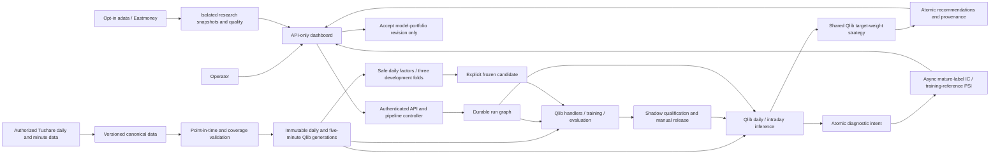

# 系统框架

QUAP is a single-machine, single-operator A-share research platform. Qlib is the required foundation for features, trained predictions, strategy calculations, and simulated evaluation. The platform collects and validates authorized data, orchestrates work, and presents proposals for human acceptance.

This overview describes the Qlib-centered working-tree implementation, not production qualification or the version currently running on an operator's machine. See [architecture](系统架构设计.md), [deployment](部署说明.md), and [validation evidence](系统验证报告.md). The older internal roadmap is historical and does not authorize native recommendations or an account ledger.

Outputs are exact target stock weights and explicit cash, not executable quantities or brokerage holdings. No balances are collected and no orders are submitted. Low price means low raw nominal price, not undervaluation. Coverage remains Shanghai/Shenzhen Main Board, STAR Market, and ChiNext.

[Architecture diagram](architecture.svg)

## 代码布局

| 路径 | 职责 |
| --- | --- |
| `src/quant_platform` | 平台包。导入本包不会导入 Qlib |
| `tests` | 平台测试。PostgreSQL 用例需要 `QUANT_TEST_DATABASE_URL` |
| `deploy` | Dockerfile、Compose 和本地密钥准备脚本 |
| `docs` | 本框架说明、部署说明和架构图 |

命令行入口是 `quant-platform`。包版本 `0.1.0`，要求 Python 3.11 或 3.12。

## Processes and storage

Compose project `quant-platform` uses UID 10001 application containers, read-only roots, `/tmp` scratch space, persistent volumes, and `unless-stopped`. A failed health check does not restart a running process. Workers renew 60-second leases; task-specific deadlines bound execution.

| Service | Responsibility |
| --- | --- |
| `postgres`, `migrate` | PostgreSQL 16 and Alembic through `0008`; no host database port |
| `api`, `dashboard` | Authenticated `/api/v1` on loopback :8000; API-only UI on :8501 |
| `scheduler` | Leader-locked source scheduling, run identities, monthly/weekly challengers |
| `history` | Directory, calendars, daily prices/factors, benchmark, risk history, dated limits |
| `minute-history`, `minute-live` | Historical five-minute bars; live finalized bars and same-day recovery |
| `qlib-data` | Immutable generations, normalization, historical coverage, handlers |
| `qlib-train` | Separate daily/intraday training, Qlib evaluations, sealed recorders |
| `qlib-daily`, `qlib-intraday` | Isolated inference queues and fenced publication |
| `quotes`, `analysis` | Price display and legacy basket monitoring only; no recommendation engine |
| `notify` | Durable, deduplicated meaningful-change notifications; stale events skipped |
| `operations` | Snapshot-consistent backup, conservative retention, operational observations |
| `research-data` (opt-in) | Pinned adata, explicit bounded collections, isolated snapshots/quality; 1 CPU / 2 GiB |
| `qlib-research` (opt-in) | Immutable baseline/candidate development trials; 2 CPUs / 8 GiB |
| `qlib-diagnostics` (opt-in) | Training-reference drift and delayed realized-label feedback; 2 CPUs / 4 GiB |

The four Qlib services are mandatory standard services, not a Compose profile. Training has an 8 GiB container limit; other engine services have 4 GiB each. Resource limits are not validated capacity promises. No Redis, Kafka, public MLflow server, trading gateway, or external orchestrator is introduced. Closing the browser does not stop workers.

## Workflows and interaction

1. Validate entitlements, completed exchange calendars, canonical data, dated security states, and price limits. Bootstrap defaults are 1,500 daily sessions and 252 historical research-pool sessions.
2. Train daily Alpha158/DatasetH/LGBModel and a separate five-minute DataHandlerLP/DatasetH/LGBModel. Fit processors only on training samples; purge overlapping labels.
3. Evaluate through Qlib signal and portfolio records using the same target-weight strategy as publication. Passing candidates remain challengers until production shadow evidence and manual promotion pass.
4. Daily inference publishes target proposals and the next session's shortlist. Minimum market coverage is 95%; all existing positive-weight portfolio members must independently have usable inputs.
5. Freeze the live minute pool: portfolio members, watchlist, then up to 200 shortlist names, capped at 300. Explicit selections cannot be silently dropped. New names remain warming up until their 20-session context is ready.
6. Reconstruct historical pools from out-of-sample daily predictions with dated weights and cash. Minute training waits for exact scoped collection jobs and checks all 48 bars on each active date. Today's pool is never substituted for history.
7. Intraday inference retains or halves daily targets. Publication is due by bar-end +120 seconds; effective times are future boundaries. Reports expire on supersession, seven minutes after bar end, or session close. Lunch/overnight signals cannot create backdated simulated fills.
8. Accept selected changes as a versioned model portfolio with exact weights and cash. Expired reports, changed policies/portfolios, and invalid releases reject acceptance. Neither acceptance nor notifications submit orders.

Six workspaces: Overview; My Model Portfolio; Stock Research; Low-Price Scan; Models & Validation; Data & Pipeline. Data refresh, inference, and challenger training are separate actions. Normal report reads never start work.

## Isolated research workflows

The `research` Compose profile is opt-in; canonical collection and the four standard Qlib services remain mandatory. Migrations `0006`–`0008` add supplemental sources/snapshots/quality, factor/configuration/trial lineage, and diagnostic observations without rewriting `0004`/`0005`.

1. In Data & Pipeline, acknowledge upstream terms and enable a source revision, then explicitly request up to 50 stocks. Deployment collection is separately disabled by default. Quarantined/empty/error results stay visible and cannot overwrite successful immutable snapshots or qualify canonical data. The pinned daily adapter uses HTTP and remains unavailable; intraday is same-day only. Fixture adapter tests do not certify provider access or data rights.
2. In Models & Validation, create restricted daily factors and ordered factor sets, then immutable LightGBM configurations. Compare baseline/candidate on one qualified Tushare generation using three purged, fixed chronological development folds. Insufficient history is rejected; the final test is reserved. Inspect trial attempts, validation curves, coverage, distributions, bounded correlations, and per-feature IC stability.
3. Explicitly freeze a configuration before requesting a challenger. Code/dependency/feature/label identity is pinned; changed identity requires a new comparison. Test exposures remain recorded and reused holdouts are not fresh unbiased evidence. No research completion or freeze creates a release or recommendation.
4. Prediction publication records only diagnostic intent. Separate bounded jobs compute IC/Rank IC after the exact training label matures, using the original scored universe and source revisions. Fewer than 30 valid pairs, missing prices, and constant scores are insufficient data. PSI uses training-quantile bins with missing/underflow/overflow handling and matching minute time-of-day cohorts. Daily/minute rollups are separate; minute observations are aggregated per session.

Stock Research shows canonical raw OHLC/volume and Qlib score/rank history with feature cutoff versus observation time; supplemental snapshots are separately labeled. All diagnostic thresholds are informational. They cannot rank stocks, change weights, train automatically, promote models, or bypass manual acceptance. Old models without saved training baselines show unavailable drift.

RD-Agent and multi-agent advisory research are deferred, separately authorized work. No paid LLM calls, data egress, framework installation, or generated-code execution is part of this delivery. Trusted research subprocesses are not arbitrary-code sandboxes.

## Data and publication contracts

- Canonical identity: `SH600895`; provider identity: `600895.SH`. Raw OHLC and turnover remain CNY; physical volume is shares. Daily provider lots/amount are converted at ingestion.
- Frozen symbol anchors define `qfactor = source_factor / anchor`. Qlib prices/VWAP multiply by qfactor; Qlib volume divides by it. `close/factor` and `volume*factor` recover physical units. Zero-volume VWAP remains missing.
- Daily and minute generations are separate, immutable, checksummed snapshots. Canonical minute timestamps are stored in UTC and interpreted with Shanghai exchange sessions; no synthetic lunch bars or candles from quote polls.
- Every recommendation links source watermark, universe/policy/portfolio revisions, generation, fitted processors, model/strategy, passing evaluation, prediction, validity interval, and human decision.
- PostgreSQL `FOR UPDATE SKIP LOCKED`, renewable leases, dependency edges, persistent request aliases, and fencing protect publication. Artifacts are written and verified before transactional references become visible.
- Initial policy: long-only; up to 20 names; at most 5% per name; at least 5% cash; 0.5-percentage-point change band. Residual cash is not normalized away.
- Low-price eligibility defaults to raw price >0 and ≤CNY 10, at least 120 listed sessions, CNY 20 million average 20-session turnover, and verified risk/tradability. Ranking comes from Qlib predictions. Above-ceiling holdings remain analyzable and are not forced out by the scan.
- Quote freshness and legacy monitoring are diagnostic behavior only. Missing Qlib prerequisites block recommendations without a native fallback.

## 安全与外部依赖

Tushare is the only production source. Daily Qlib prerequisites are `stock_basic`, `trade_cal`, `daily`, `adj_factor`, `index_daily`, `namechange`, `stk_limit`, and `suspend_d`; intraday additionally requires `stk_mins`, `rt_min`, and `rt_min_daily`. Quote monitoring separately uses `rt_k`. A paid account proves neither entitlement nor historical availability, latency, or redistribution rights. No public or synthetic production fallback exists.

传输是校验证书的 HTTPS POST，目标 `https://api.tushare.pro`，关闭重定向和环境代理。`doctor` 按真实访问和返回结构探测能力；空的必需响应不算通过。权限失败保持阻塞，配额等待不耗尽失败重试。

The single-operator Bearer token protects data and mutations; only liveness is anonymous. The dashboard receives no database/provider secrets. API/UI are loopback-bound. Application services share a login credential; API read/write pools can assume `quant_read`/`quant_worker` roles. This is not separate per-service authentication or multi-tenant authorization.

四个密钥文件放在 `deploy/secrets/`：`postgres_password`、`database_url`、`api_token`、`tushare_token`。它们排除在 Git、Docker 构建上下文和发行包之外。数据库 URL 形如 `postgresql://quant:<URL编码密码>@postgres:5432/quant`，并且与 PostgreSQL 密码一致。

## Required Qlib boundary and release gates

`pyqlib==0.9.7` and `lightgbm==4.7.0` are installed only in Linux AMD64 engine images. The packaging extra isolates dependencies; setting `QUANT_QLIB_ENABLED=false` is rejected. ARM emulation is a development option, not latency evidence. External research datasets are read-only and never overwritten.

Training defaults are 756/252/252 daily and 120/40/60 minute train/validation/test sessions, with warm-up and purging. Daily candidates require positive held-out Rank IC, positive net excess return, and maximum drawdown no worse than 20%. Intraday must not degrade matching daily-only cost-adjusted return or drawdown.

Promotion requires 20 recent healthy production shadow trading sessions across the same workflow lineage, the candidate's own passing evaluation and healthy shadow evidence, and manual approval. Lineage and candidate-owned observations use the same preceding 60-day window, excluding the current Shanghai date and requiring both exchanges to be open. Intraday health requires every one of the 44 eligible observation cutoffs; missing slots are disclosed and duplicates do not count. Model age is limited to 35 calendar days daily and 14 intraday. Failed challengers do not replace active models; expired models block that frequency.

Live model loading uses LightGBM text, JSON, and numeric NPZ with `allow_pickle=False`; it does not unpickle uploaded bundles. There is no model-upload interface. Engine failures leave collection/diagnostics available, not substitute recommendations.

## 旧监控边界

外部旧监控进程使用 SQLite 和可选的 Qlib 文件，独立于本仓库维护，不是本平台内部的降级路径。本平台通过 `import-legacy` 只读导入其运行时来源。准备期间让 QUAP 的行情轮询保持暂停，并且不要让两套进程同时拥有同一观察列表的实时采集和告警。凭证、参考数据与历史覆盖、以及只读来源导入都核对之后，再做一次明确的所有权切换。切换步骤见[部署说明](部署说明.md)。

## 备份与单机限制

A `quap-snapshot-v1` tar bundle contains a PostgreSQL dump and every referenced generation/model/recorder and research snapshot/trial/diagnostic artifact under one exported repeatable-read snapshot, with checksums. Restore requires an empty `quant_restore_*` database and a new artifact destination. Legacy database-only `.dump` files are retained but not accepted by the new restore path.

Retention protects database references and retained-backup references; it does not keep only two generations. Abandoned owned generations, models, research artifacts, and marked recorders expire after the task grace period when no Qlib work is running. New recorders carry a checksummed ownership marker; legacy/unmarked recorders, experiment metadata, and symlinks are preserved. Disk monitoring remains necessary. Local backup volumes share the host's failure domain; off-host replication and restore exercises remain operator responsibilities.

Two-session quote-monitoring observations do not satisfy Qlib release qualification. Fixture tests, running containers, and syntax-valid Compose are not production acceptance. Actual permissions, historical point-in-time coverage, performance, shadow sessions, latency/capacity, and off-host recovery must be separately verified.
